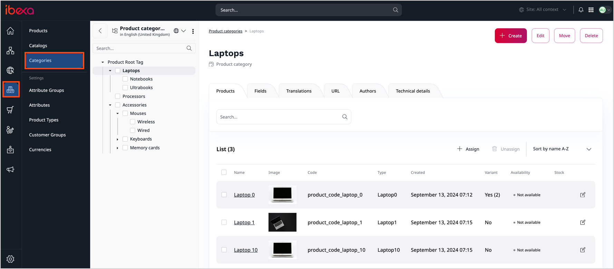
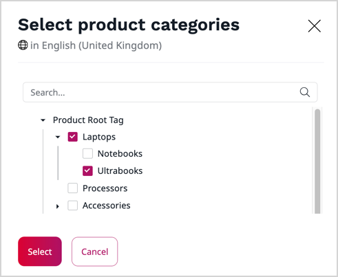
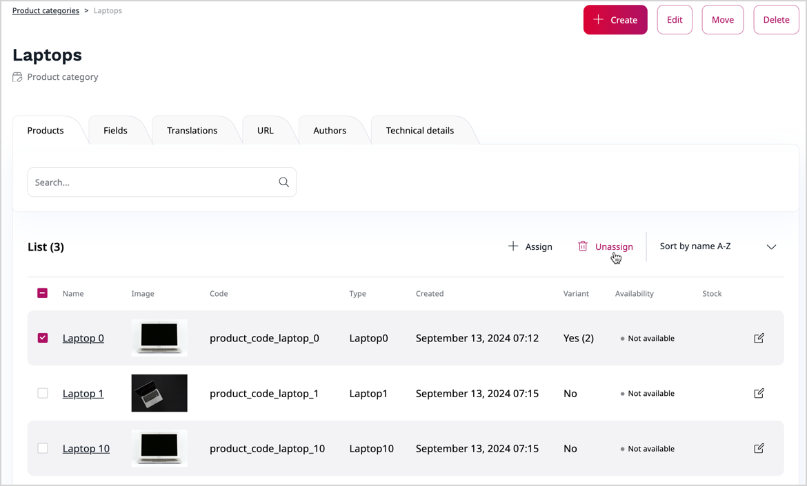

# Work with product categories

[Product](products.md) categories are organized into a Category tree, which you can access from the **Product catalog** panel.
The **Categories** screen is where you manually create a hierarchy of categories and manage category entries.

## Product categories

With product categories you can organize products within PIM and create relationships between them.
One of the reasons for applying product categories is assisting visitors in searching for products.

Each category can be assigned to multiple products, and each product can belong to multiple categories of different or similar character, for example:

- Business Laptops
- Windows OS Devices
- Stock clearance

You can enable the use of product categories, assign products to categories and vice versa, and define your own categories.

## Enable product categories

Before you can assign categories to products, make sure that the *Taxonomy Entry Assignment* field is added and set as required in all the [product types](product_types.md) that define products from PIM which you want to categorize.
The field could be absent if product types were migrated from an older version of [[= product_name =]].

Depending on your permissions, you might be able to verify the presence of the field and add the field yourself:

1. In the left panel, click **Product catalog** -> **Product Types** to open a list of available product types.
2. Click the **Edit** icon next to a name of the product type that you want to review.
3. In the **Editing Product Type** modal, check whether the **Field definitions** area contains the **Categories** field of *Taxonomy Entry Assignment* type.
    1. If the field is present, click **Delete draft** and skip the remaining steps.
    2. If the field is absent, drag and drop the *Taxonomy Entry Assignment* option from the **Field types** area to the **Field definitions** area.
    3. Expand the **New field type** that you added and make the following settings:
        * Set a name for the field, for example, "Product category"
        * Select the **Required** checkbox
        * In the **Taxonomy** field, select the "Product categories" taxonomy type
4. Optionally, modify other product type settings as required.
7. To save your changes:

    - Click **Save** to continue editing.
    - Click **Save and close** to close the window.

You can now add product categories and then create relationships between products and product categories.

!!! caution "Duplicate taxonomy entry fields"

    In your product type, you may want to have both product categories and [tags](taxonomy.md) on the list of field definitions.
    Because tags are assigned per product item, not per field, when working with a product type, you cannot use two *Taxonomy Entry Assignment* fields with the same taxonomy type in one product type.

## Add product category to product category hierarchy

Similarly to other items in [[= product_name =]], you add product categories either by clicking the **Create** button, or directly in the product category tree:

1. In the left panel, click **Product catalog** -> **Categories** to navigate to the product category tree.
2. To add a category using the **Create** button, in the category tree, select the category to which you want to add a child category. After the details of the selected category are loaded, click the **Create** button and skip to step 4.
3. To add a category directly in the category tree, click the three dots icon next to the category to which you want to add a child category. In the context menu, click **Add**.
4. In the product category editing modal, make the following settings:
    * Enter a unique identifier for the product category, for example, "HW_WIN".
    * Enter a unique name for the product category, "Devices with Windows".
    * Optionally, change the parent category of the currently edited category:

          In the **Parent** area, click the **Change path** button. Then, in the **Select parent** modal, select a category from the tree and click **Select parent**.

    * Click **Save** to save the product category.

The newly created category can now be assigned to products.

## Modify product category assignments to products

You can create or change product category relationships with products in two ways: either when you edit or create a product item, or when you edit a product category.

!!! note

    Products must be of product type which is [enabled for categorization](#enable-product-categories).

### Assign product categories by editing product details

1. In the left panel, click **Product catalog** -> **Products** to navigate to the product list.
2. To create a new product item, click the  **Create** button, select the product types with product categories enabled, and click **Add**. Then skip to step 4.
3. To edit an existing product item, click the **Edit** icon next to a name of the Product item that you want to modify.
4. In the product type editing modal, go to the **Product category** area and click the **Select product categories** button.
5. In the pop-up window, select checkboxes next to product categories related with the product.
6. Click **Select** to close the pop-up window.
7. Optionally, modify other product information as required.
8. Click **Create** or **Update** to save your changes.

### Assign products by editing product category details

1. In the left panel, click **Product catalog** -> **Categories** to navigate to the product category tree.
2. In the product category tree, select a category and go to the **Products** tab.
3. To assign products to the current category:
    1. Click the **Assign** button.
    2. In the content browser, select checkboxes next to products related with the category.
    3. Click **Confirm** to confirm the selection.
4. To unassign products from the current category:
    1. In the **Products** tab, select checkboxes next to products selected for removal.
    2. Click the **Unassign** button

