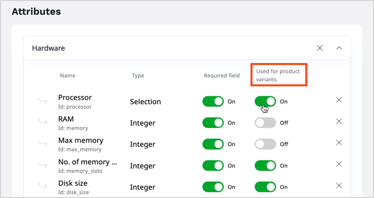
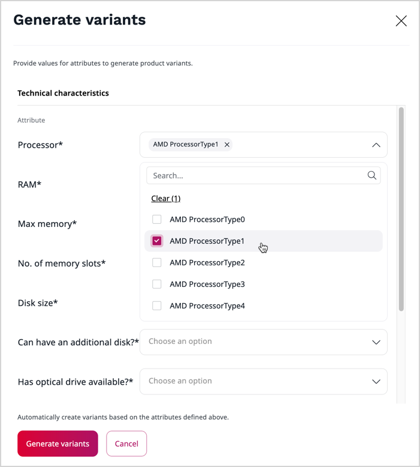
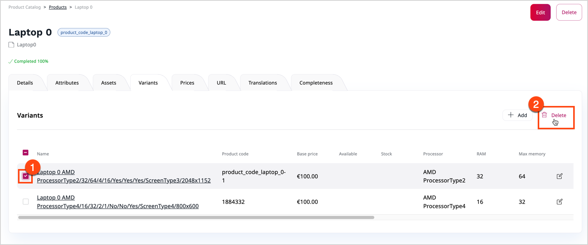

# Work with product variants

With product variants you can have multiple versions of one product, differing in some characteristics.
Typical example would be a t-shirt in different sizes and colors, or the same model of laptop with different hard disk sizes.

To use an [attribute](work_with_product_attributes.md) to create variants, mark the attribute as **Used for product variants** when you create a [product type](create_product_types.md).

If a product has only one attribute that can be used for variants, you can create variants for this attribute.

If a product has more than one such attribute, you can create variants for any combination of attribute values.
For example, for a desk that has two top colors: `white` and `oak` and two frame colors: `black` and `grey`,
you can create up to four variants: `white/black`, `white/grey`, `oak/black`, and `oak/grey`.

### Generate variants

You can generate variants automatically based on the configured attributes.

To generate variants:

1. Go to the **Variants** tab in product view and click **Generate variants**.

2\. For each attribute listed, select the values you want to create variants for.

3\. Confirm with **Generate variants**.

You can now see a list of all possible variants for the selected attribute values.

### Delete variants

You can delete any generated product variant.
To do it, select one or more variants in the list and click the **Delete** button.

### Manually create variants

If needed, you can manually create any missing variants, including ones you previously deleted.
To do this, click **Add** next to the variant list, enter a product code and select attribute values for the new variant.

### Manage variants

You can set up product availability separately for each product variant.

You can also set up prices per product variant.
This new prices overrides prices set for the main product.
If you do not define a price for a variant, the price of the main product is used.
