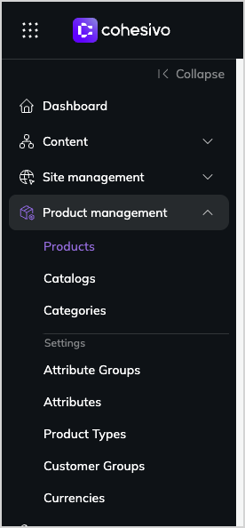

# Product catalog

With Product catalog you can create, configure, and manage products that are offered in the [[= product_name =]]-based website and/or storefront, including their specifications, attributes, assets, variants, and pricing.

You can group products into categories and catalogs.
Catalogs are collections of products selected with configurable filters.
Categories let you organize products within product catalog and create relationships between them, for example, to help customers in searching for products.

Product catalog's features are available from the left-hand menu.

You can use [[= product_name =]]'s built-in product management, or connect it to an external product information management (PIM) system.
[[[= pim_product_name =]] PIM integration](quable_pim_integration.md) allows you to use [[= pim_product_name =]] as the source of product data, while using [[= product_name =]] for marketing activities, [managing prices](manage_prices.md), and [availability and stock](manage_availability_and_stock.md).

[[= cards([
    "product_catalog/quable_pim_integration",
    "product_catalog/product_types",
    "product_catalog/create_product_types",
    "product_catalog/products",
    "product_catalog/create_edit_product",
    "product_catalog/work_with_catalogs",
    "product_catalog/work_with_product_categories",
], columns=3) =]]
