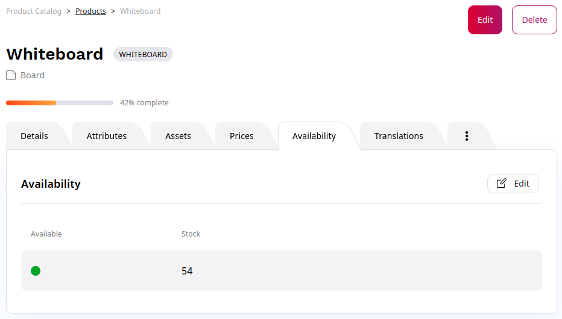
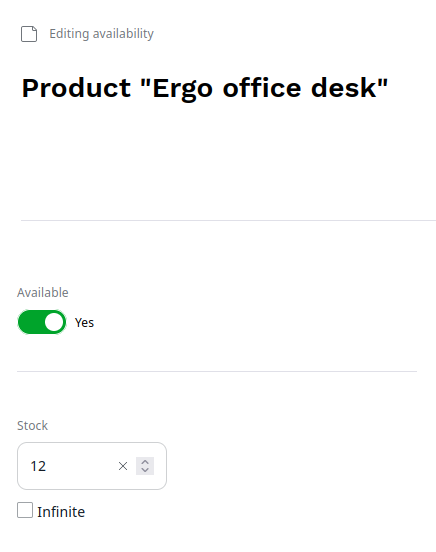
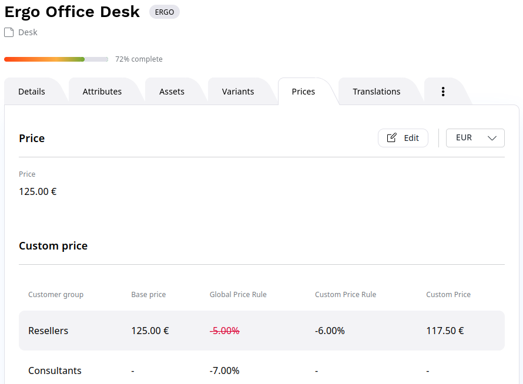
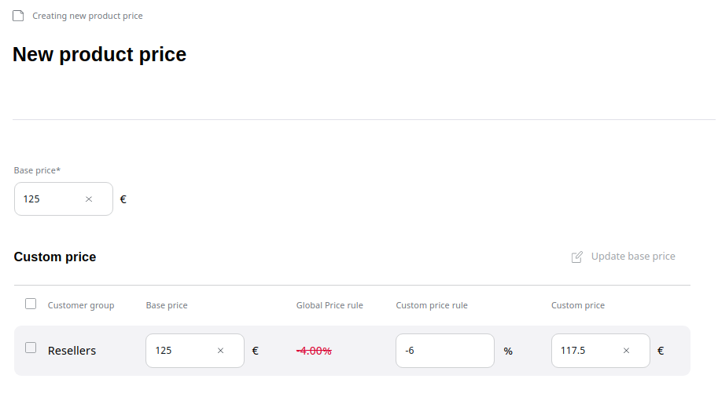

# Work with availability, stock and prices

[Products in catalog](understand_products.md#products) can be made available in certain quantity, unavailable, 
and can have a base price and custom prices defined per [customer group](../shop_administration/manage_customers.md) and per [currency](../shop_administration/manage_currencies_shipping.md).

## Set product availability

To control a product's availability and the available stock, in product or variant view go to **Availability** tab.
If a product can have variants, you must set availability for each variant separately.

In the **Availability** tab, click **Create** to add availability to a product that doesn't have it,
or **Edit** to modify existing availability settings.

Use the **Available** switcher to indicate whether the product is currently available in the catalog.

You can also set the exact number of products available in stock.
Set the availability to **Infinite** if specific stock number is not tracked.
You can use it, for example, for digital download products.

## Manage product prices

Price management enables you to set up product prices manually. 
A price can be set up per product and product variant.

In addition, prices can vary per [customer group](../shop_administration/customer_portal.md).

!!! note

    To set up product prices, your system must have at least one currency enabled.

To set a price, navigate to the product's or a product variant's **Prices** tab.
Here you can see the existing prices for the selected [currency](../shop_administration/manage_currencies_shipping.md).

Select a currency in the dropdown menu to preview the price and click the edit button to modify it.

For each product or product variant you can set prices separately for different customer groups.
Next to the base price you can see the **Global Price rule** defined for this customer group,
which is applied to the base price.
However, you can also set a **Custom price rule** for this product.
If you define it, the Global Price rules does not apply and the custom price rule is applied directly to the base price.

You can preview the resulting price for this product and the given customer group in the **Custom price** field.

