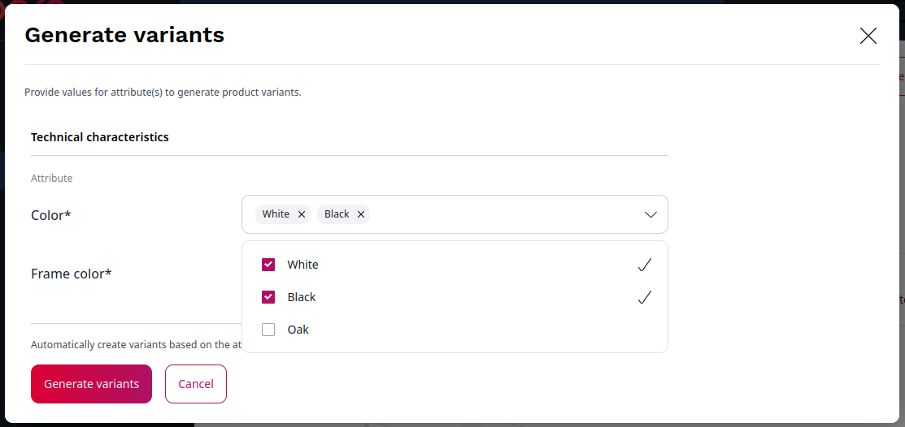

# Product variants and assets

## Product variants

Product variants enable you to have multiple versions of one product, differing in some characteristics.

Typical examples are a t-shirt in different colors, or a laptop with different hard disk sizes.

You can create variants based on product attributes.
To use an attribute to create variants, mark the attribute as **Used for product variants** when creating a product type.

If a product has only one attribute that can be used for variants, you can create variants for this attribute.

If a product has more than one such attribute, you can create variants for any combination of attribute values.
For example, for a desk that has two top colors: `white` and `oak` and two frame colors: `black` and `grey`,
you can create up to four variants: `white/black`, `white/grey`, `oak/black`, and `oak/grey`.

### Generate variants

You can generate variants automatically based on the configured attributes.

To generate variants:

1. Go to the **Variants** tab in product view and click **Generate variants**.

2\. For each attribute listed, select the values you want to create variants for.

3\. Confirm with **Generate variants**.

You can now see a list of all possible variants for the selected attribute values.

### Delete variants

You can delete any generated product variant.
To do it, select one or more variants in the list and click the **Delete** button.

### Manually create variants

If needed, you can manually create any missing variants, including ones you previously deleted.
To do this, click **Add** next to the variant list, enter a product code and select attribute values for the new variant.

### Manage variants

You can set up product availability separately for each product variant.

You can also set up prices per product variant.
The prices will override prices set for the main product.
If you do not define a price for a variant, the price of the main product is used.

## Product assets

You can add assets to products in the form of images.
Assets can be assigned to the base product, and to one or more of its variants.

To add assets to a product, in the product's **Assets** tab browse or drag and drop image files from disk,
or select an existing image asset from library.

You can assign assets to product variants by placing them in a collection.
A collection corresponds to specific values of attributes and is assigned to the variant or variants
that have these attribute values.

For example, a "desk" product can have multiple images as assets.
You can group them into collections for specific desktop and frame colors,
corresponding to variants.

