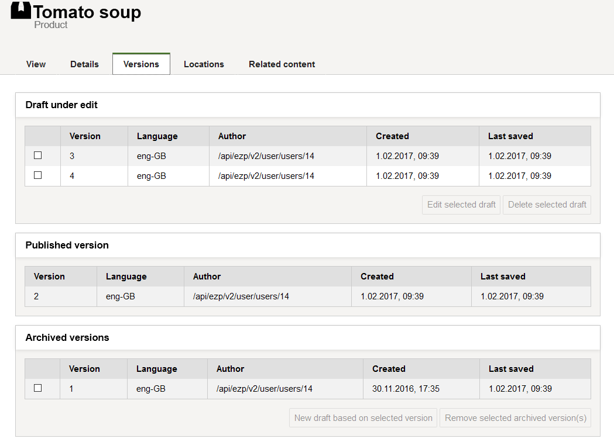
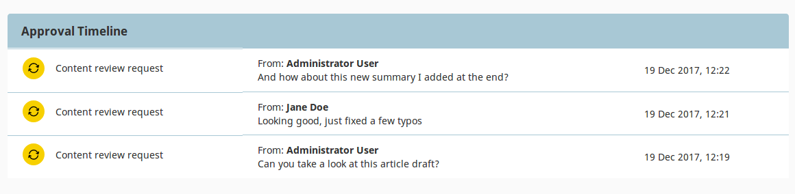
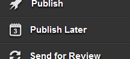
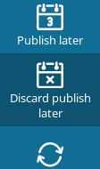

# Publishing

## Publishing Content

When you **Publish** a Content item, it is given a Location ID and placed in the Content tree.
It is then immediately available to the visitor.

Instead of instantly publishing you can also Save, Discard Changes, [Publish later](#date-based-publishing) and [Send for Review](#review-workflow).
All these options are available in the menu when you are in the edit mode.

### Publishing vs. saving

Choosing **Save** does not immediately publish the Content item.
Instead, it will save the new version of the content as a **Draft**.
You can then keep on editing the same content and save it again when needed.
You can then leave the editor by using the X icon in the upper left corner.

!!! caution

    Selecting **Delete draft** will remove the whole draft and all the work you have done on it.
    A discarded draft is removed instantly, not placed in the Trash, so it can't be restored.

Once you leave the editor after saving your draft, you can return to modify it, or create a new draft.
To edit an existing draft, go to the **Versions** tab and click the edit icon in the proper line.
When you select **Edit** in a Content item that has one or more open drafts, you will be asked which draft you want to continue working on.
You will also have the option to create a new Draft based on the currently published version.

Note that you cannot edit an unpublished draft created by another user.

### Content versions

Content in the repository can have more than one version.
Each version is either Published, Archived or Draft.

The **Published version** is the version that is currently used on the website.
Every Content item can have only one Published version at a time.

Whenever you edit and publish a Content item again, its previous Published version becomes an **Archived version**.
It is not available to the visitor and you cannot edit it, but you can create new drafts based on any Archived version.

Finally, **Drafts** are version that have not been published yet.

You can view all versions of a Content item in the **Versions** tab.

!!! enterprise

    ## Review workflow

    The review Workflow in eZ Enterprise operates on drafts of Content items.

    When working on a Content item draft, do not publish it,
    but instead click **Send for review** in the menu and select a user.
    This user will be notified of your request and will be able to view your draft.
    Then they can introduce their own modifications and create a new draft, or leave your draft as it is.
    Finally, they can publish the latest draft (yours or their own) or send it on to another reviewer.

    ### Reviewing a draft

    When you are selected as a reviewer for a Content item, you can be notified about it in two ways:

    - You receive a notification about it by email. The message contains a direct link to the draft.
    - You also receive notifications in your user profile. When you are logged in, a number appears next to your profile picture
    (in the upper right corner of the screen) which shows how many requests for review you have received.
    Go to your profile and choose View notifications. You can see a Notifications window with a list of all requests.

    When you start editing a Content item which has been sent to review, you will see the Approval Timeline at the top of the screen.
    This timeline lists all review requests that have been sent out for this Content item.

    

    Once you start editing the Content item, you can modify or publish it in the same way you edit a standard Content item.
    You can also send it on to another reviewer.

## Advanced publishing options

!!! enterprise

    There are three ways in which you can schedule Content to be published in the future:

    - [Schedule tab](#schedule-tab) in any Page block's configuration
    - [Content Scheduler block](#content-scheduler-block) on a Page
    - [Publish later option](#date-based-publishing) when editing content

    ### Schedule tab

    The Schedule tab is available in the configuration of all Page blocks.
    You can use it to set the date and time when the block becomes visible and when it disappears from a Page.

    

    ### Content Scheduler block

    In the Content Scheduler block you can select Content items to be displayed at a selected time.

    For each Content item you can choose an airtime - a date and time in the future.
    At this time the Content item will become visible.

    The Content Scheduler block has a limit of Content items.
    If the limit is filled and a new Content item is displayed, the oldest item will disappear from the block.

    

    ### Date-based publishing

    When editing a Content item, select **Publish Later** in the menu on the right.

    

    You will see a **Future publication setting** window. Choose a date and time and the content will be published at that time.

    If you had planned a future publication date and enter the edit mode of the same Content item,
    you also have a new option in the menu: **Discard publish later**.
    Use it to remove the previously selected publication date.

    

    ### Timeline

    The timeline in Page mode shows all changes that will happen to the Page in the future.

    You can use the slider to preview what the Page will look like at a given time.
    Use the button on the right of the time to see a list of all upcoming changes.

    
