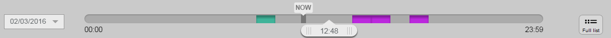

# Publishing

## Publishing Content

After you've finished working with a Content item, the most straightforward option is to **Publish** it.
It will then be given a Location ID and placed in the Content tree, immediately available to the visitor.
You have, however, a couple of other options at this point, all available in the menu when you are in the edit mode:
Save, Discard Changes, [Publish later](#date-based-publishing) and [Send for Review](#review-workflow).

### Publishing vs. saving

In contrast with publishing, choosing **Save** does not immediately publish the Content item.
Instead, it will save the new version of the content as a **Draft**.
You can then keep on editing the same content and save it when needed and the draft will be amended.
You can then leave the editor by using the X icon in the upper right corner.

*Selecting **Delete draft** will remove the whole draft and all the work you have done on it!
A discarded draft is removed instantly, not placed in the Trash, so it can't be restored!*

Once you leave the editor after saving your draft, you can return to modify it, or create a new draft.
To edit an existing draft, go to the **Versions** tab and click the edit icon in the proper line.
When you select **Edit** in a Content item, you will create a new draft.
Note that you cannot edit an unpublished draft created by another user.

### Content versions

As you can see, content in the repository can have more than one version.
Each version is either Published, Archived or Draft.

The **Published version** is the version that is currently used on the website.
Every Content item can have only one Published version at a time.
Whenever you edit and publish a Content item again, its previous Published version becomes an **Archived version**.
It is not available to the visitor and you cannot edit it, but you can create new drafts based on any Archived version.
Finally, there are the already discussed **Drafts**. You can view all versions of a Content item in the **Versions** tab.

!!! enterprise

    ## Review workflow

    The review Workflow in eZ Enterprise is handled by a functionality called Flex Workflow.
    Flex Workflow operates on drafts of Content items.

    After creating a new Content item or making changes to it, do not publish it,
    but instead activate **Send for review** in the menu and select a user.
    This user will then be notified of your request and will be able to view your draft.
    Then they can introduce their own modifications, creating a new draft, or leave your draft as it is.
    Finally, they can publish the latest draft (yours or their own) or send it on to another reviewer.

    ### Reviewing a draft

    When you are selected as a reviewer for a Content item, you can be notified about it in two ways:

    - You receive a notification about it by email. The message contains a direct link to the draft.
    - You also receive notifications in your user profile. When you are logged in, a number appears next to your profile picture
    (in the upper right corner of the screen) which shows how many requests for review you have received.
    Activate your profile and choose View notifications. You can see a Notifications window with a list of all requests.

    When you start editing a Content item which has been sent to review, you will see the Approval Timeline at the top of the screen.
    This timeline lists all review requests that have been sent out for this Content item.

    

    Once you start editing the Content item, you can modify or publish it in the same way you edit a standard Content item.
    You can also send it further along to another reviewer.

## Advanced publishing options

Aside from publishing your content immediately, you have two ways of making sure your content is published at a given date in the future:
Date-based publishing and [Schedule blocks in the Landing Page](#scheduling).

!!! enterprise

    ### Date-based publishing

    In eZ Enterprise, select **Publish Later** in the menu on the right.

    

    You will see a **Future publication setting** window. Choose a date and time and the content will be published at that time.

    If you had planned a future publication date and enter the edit mode of the same Content item,
    you also have a new option in the menu: **Discard publish later**.
    Activate it to remove the previously selected publication date.

    

!!! enterprise

    ### Scheduling

    You can plan for content to be published in the future using Landing Page's Schedule block.
    When you place the block on your page, it will display a number of empty slots.
    You can add existing content to each of them by selecting the  icon.
    The number and layout of the slots depends on the template for the block.
    Each Content item you add has its own options menu available when you hover the pointer over the block.
    There you can choose  airtime (publication date)
    and select a date and time when you want the content to appear in the slot.
    The menu also has an option to delete an item from the slot. Notice that the content will be ordered by its airtime,
    not the order in which it was added to the block, or its publication date.

    

    If all slots in a Schedule block are filled and you try to add another one, the oldest Content item will be pushed off the block.
    Among the options for the Schedule block you have the possibility to set up **Overflow**,
    which decides what happens to a Content item in this situation.
    When Overflow is enabled, the content that is pushed off will be moved to a different, selected Schedule block.
    Content that overflows to a different Schedule block will be ordered by its airtime,
    and not by the order in which it was pushed off the original block.

    

    You can view all the changes to Schedule blocks in the timeline that appears at the top of the page when a block is activated.
    It covers one day and contains colored stripes that indicate when a change happens.
    You can drag the slider, and the preview on the page will change, showing what the page will look like at a given time.
    To see details of all changes happening at a given hour, activate the colored indicator.
    You can also see the list of all changes in a given block by selecting **Full list** in the timeline bar.
    The timeline records whenever a Content item is added, deleted or overflown to the block.

    

    Deleting Content from a Schedule block works differently depending on what had happened with it before:

    - If you remove a Content item immediately after it is added, it will be removed completely
    (it will not remain in the history).
    - If you delete it after a longer time, especially after the block has been published,
    it will be removed from the Schedule Block, but will be available in history by dragging the Timeline slider.
    - If you remove a Content item from a Schedule Block *with overflow enabled*,
    all other Content items, including those which have been pushed to a different block, will move backwards.
