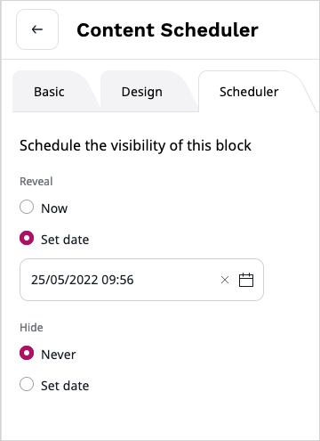
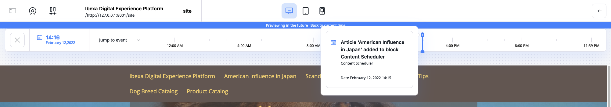
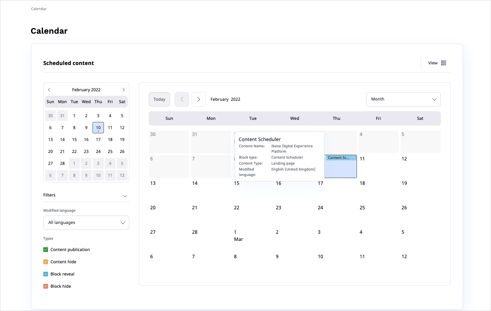
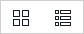
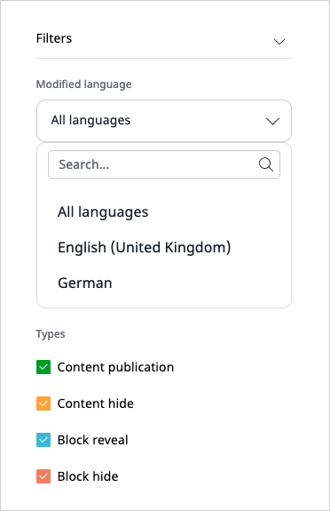
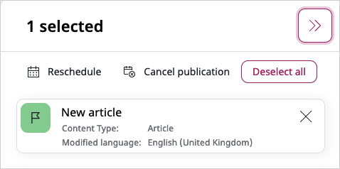
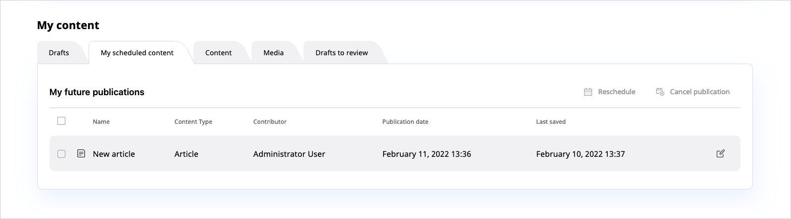

# Advanced publishing options

!!! dxp

    There are three ways in which you can schedule content to be published in the future:

    - [Schedule tab](#schedule-tab) in any Page block's configuration
    - [Content Scheduler block](#content-scheduler-block) on a Page
    - [Publish later option](#date-based-publishing) when editing content

    ## Schedule tab

    The Schedule tab is available in the configuration of all Page blocks.
    You can use it to set the date and time when the block becomes visible and when it disappears from a Page.

    

    ## Content Scheduler block

    In the Content Scheduler block you can select Content items to be displayed at a selected time.

    For each Content item you can choose an airtime - a date and time in the future.
    At this time the Content item will become visible.

    The Content Scheduler block has a limit of Content items.
    If the limit is filled and a new Content item is displayed, the oldest item will disappear from the block.

    

    ## Date-based publishing

    When editing a Content item, select **Publish later** in the menu on the right.

    

    You will see a **Set publication date and time** window. Choose a date and time and the content will be published at that time.

    If you had planned a future publication date and enter the edit mode of the same Content item,
    you also have a new option in the menu: **Discard publish later**.
    Use it to remove the previously selected publication date.

    
    
    You can always [reschedule or cancel planned publications](#rescheduling-or-cancelling-publications).
    To easily browse all the future events, use the [Calendar widget](#calendar-widget).
    

    ## Timeline

    The timeline in Page mode shows all changes that will happen to the Page in the future.

    You can use the slider to preview what the Page will look like at a given time.
    Use the button on the right of the time to see a list of all upcoming changes.

    
    
    ## Calendar widget
    
    The calendar widget enables you to view and perform actions on various events.
    Out of the box, it displays Content items scheduled for future publication, but your page administrator can configure custom events.
    Therefore, the calendar can contain other events, e.g. national holidays, important dates, etc.
    
    To access the calendar widget, in the **Content Panel**, open the **Calendar** tab.
    
    
    
    You can switch between different views to see events planned for a certain day, week, or month.
    You can also use [filters](#calendar-filters) to focus on certain events displayed in the calendar.
    
    !!! tip
    
        If the number of events to display in a selected view exceeds the configured limit, some events remain hidden. 
        To view the full list of events, click **Load More**.
    
    To access the calendar features, use the following buttons:
    
    |Button|Description|
    |------|-----------|
    ||Display the current day regardless of the view.|
    ||Navigate through months, weeks, or days.|
    ||Switch between month, week, or day view.|
    ||Switch between the calendar and list view,|
    ||Access and apply calendar filters.|
    
    ### Calendar filters
        
    With numerous events appearing in the calendar widget, you can declutter the view by applying filters.
    You can filter by the events' type or modified language in all three views (month, week, and day).
        
    Access all available filters by clicking the **Filters** button.
         
    
        
    To apply filters, select or deselect entities from the **Types** or **Modified language** list.
    The calendar view refreshes automatically.
    
    ### Calendar toolbar
    
    The calendar widget toolbar displays events you select and gives you access to actions assigned to them.
    The available actions appear in the upper-right corner of the toolbar when you select an event.
    You can select multiple events of the same type and perform bulk actions on them, e.g. [reschedule or cancel publication](#rescheduling-or-cancelling-publications).
    
    !!! note
            
        Actions available in the toolbar may vary depending on the custom configuration.
        For details, contact your page administrator.
                
    
    To select, click on all events of the same type you want to add to the toolbar list.
    
    
    
    ## Rescheduling or cancelling publications
    
    In case of publishable Content items (e.g. articles), you can change or cancel their planned publication using the **Reschedule** or **Cancel publication** buttons.
    These buttons are available on the **My dashboard** screen, and in the Calendar widget.
    
    |Button|Description|
    |------|-----------|
    ||Reschedule all selected events.|
    ||Cancel the future publication of selected events.|
    
    #### Rescheduling or cancelling with the dashboard
    
    To reschedule or cancel events with the dashboard, perform the following actions:
    
    1. Open the **My dashboard** screen by clicking the eZ logo in the left-upper corner.
    1. In **My content** panel, view all your scheduled Content items by clicking **My scheduled content**.
    1. From **My future publications**, select all Content items to have their publication time rescheduled or cancelled.
    1. Using the buttons in the upper-right corner, perform one or both of the following actions:
        - To change the publication time, click the **Reschedule** button.
          In the **Reschedule** modal window, select the new date and click **Confirm date change**.
        - To cancel publication, click the **Cancel publication** button.
          In the modal window, confirm the cancellation by selecting **Cancel publication**.
          
    
    
    #### Rescheduling or cancelling with the Calendar toolbar
    
    In the [Calendar widget](#calendar-widget), select all events to have their publication time rescheduled or cancelled.
    Using the toolbar buttons, perform one of the following actions:
    
    - To change the publication time, click the **Reschedule** button.
    In the **Reschedule publication** modal window, select the new date and click **Confirm rescheduling**.
    - To cancel event's publication, click the **Cancel publication** button.
    In the modal window, confirm the cancellation by clicking **Cancel publication**.
