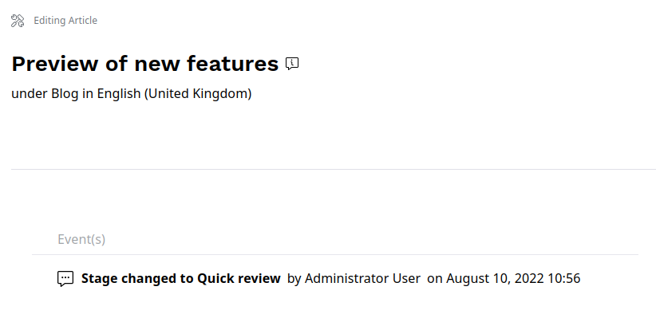
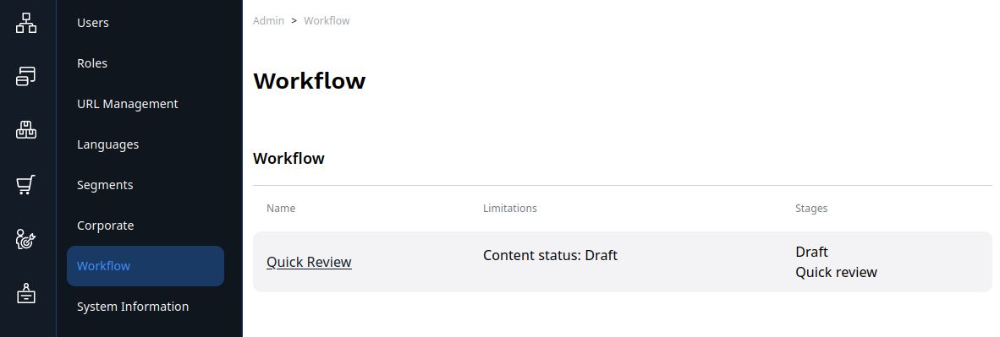
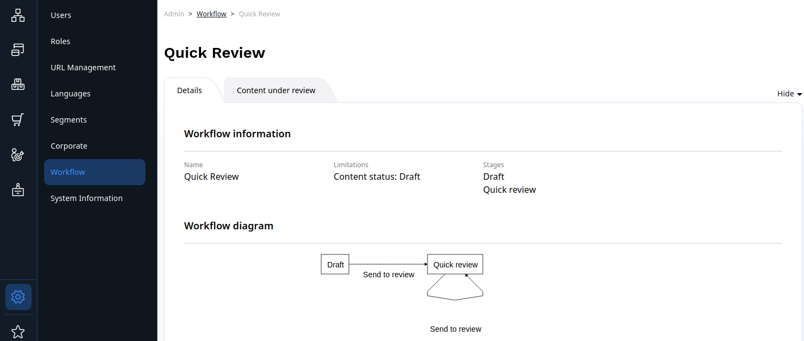

# Editorial workflow

With editorial workflow, you can pass content between different stages in a preconfigured flow.
Typically, the stages correspond to different teams or departments that contribute to content
and approve it.

For example, you can pass content through stages of draft, design and proofreading.

!!! note

    Workflows are configured differently in each installation.
    In your workflows you can have different stages and transition between them.

    Contact your administrator or developer team to configure workflows.
    See [developer documentation]([[= developer_doc =]]/guide/workflow/) for information on how to do it.

## Review queue

You can view Content items which are in different stages under review on the 
**My dashboard** screen, in the Review queue table.
The table only shows Content items that your Role has permissions to edit.
If your installation is [configured to support draft locking]([[= developer_doc =]]/guide/workflow/#draft-locking), 
the table also informs you whether any reviewers are assigned and have claimed 
their drafts for review.

In the Review queue table, you can access the draft for editing, review its history, 
and unlock the draft or request that a lock is released.

## Editing drafts

When you click the **Edit draft** icon and open a Content item that has been sent 
to you for review, you see the Events timeline that lists all the transitions 
that this content has gone through.

If draft locking is supported, you also see a message that confirms that the draft is now locked to you.

## Releasing locked drafts

If you are assigned to a draft and have locked it for review, you can release 
the lock by closing the modal window, publishing the draft, or sending it to 
another reviewer.
You can also do it in the Review queue table, by clicking the **Unlock** icon.

If you are not assigned to the draft, depending on the permissions set for your 
Role, in the Review queue table, you can either release the lock by clicking 
the **Unlock** icon, or request that the lock is released by the reviewer 
by clicking the **Request access** icon.

## Workflow list

If you have Administrator permissions, you can view all configured workflows in the Admin Panel by selecting **Workflow**.

You can preview a diagram of the workflow.

You can also select a configured workflow to see all Content items that are under 
review as part of this workflow.

