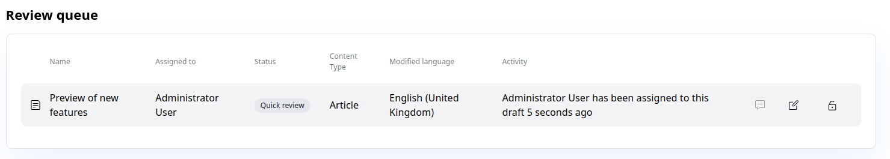
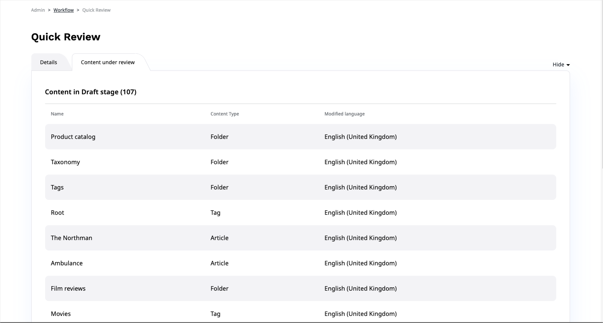

# Editorial workflow

!!! dxp

    Using editorial workflow you can pass content between different stages in a preconfigured flow.
    Typically, the stages correspond to different teams or departments that contribute to content
    and approve it.

    For example, you can pass content through stages of draft, design and proofreading.

    !!! note

        Workflows are configured differently in each installation.
        In your workflows you can have different stages and transition between them.

        Contact your administrator or developer team to configure workflows.
        See [developer documentation](https://doc.ezplatform.com/en/master/guide/workflow/) for information on how to do it.

    You can view Content items which are in different stages under review on the **My dashboard** screen, in the Review queue table.
    The table will only show the Content items that you have permissions to edit.

    

    When you edit a Content item that has been sent for review, you will see the Events timeline.

    It lists all the transitions that this content has gone through.

    

    You can view all configured workflows in the Admin Panel by selecting **Workflow**.

    

    Here you can also preview a diagram of the workflow.

    

    After selecting configured workflow administrator user is able to see all Content items under review for it.

    
