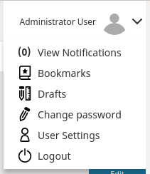
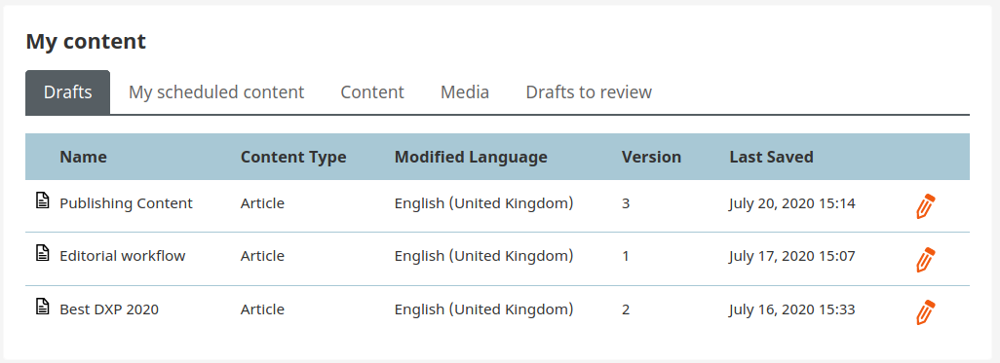

# Flex workflow

!!! enterprise

    The review feature Flex Workflow in eZ Enterprise operates on drafts of Content items.

    !!! note

        Flex Workflow is available only when there is no [editorial workflow](editorial_workflow.md) for this Content Type.

    When working on a Content item draft, do not publish it,
    but instead click **Send for review** in the menu and select a user.
    This user will be notified of your request and will be able to view your draft.
    Then they can introduce their own modifications and create a new draft, or leave your draft as it is.
    Finally, they can publish the latest draft (yours or their own) or send it on to another reviewer.

    ## Reviewing a draft

    When you are selected as a reviewer for a Content item, you can be notified about it in two ways:

    - You receive a notification about it by email. The message contains a direct link to the draft.
    - You also receive notifications in your user profile. When you are logged in, a number appears next to your profile picture
    (in the upper right corner of the screen) which shows how many requests for review you have received.
    Go to your profile and choose View notifications. You can see a Notifications window with a list of all requests.

    When you start editing a Content item which has been sent to review, you will see the Approval Timeline at the top of the screen.
    This timeline lists all review requests that have been sent out for this Content item.

    

    You can find the list of all drafts in the **Administrator User** menu.

    

    The list of your drafts is located in **My Dashboard**. You can access it by clicking on eZ icon located in the top left corner of Back Office.

    

    Once you start editing the Content item, you can modify or publish it in the same way you edit a standard Content item.
    You can also send it on to another reviewer.
