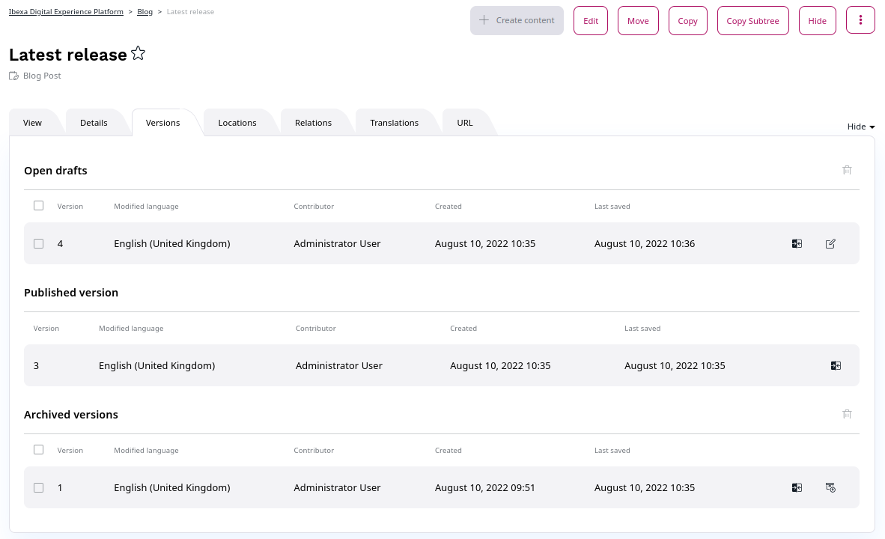

# Publishing Content

When you **Publish** a Content item, it is given a Location ID and placed in the Content tree.
It is then immediately available to the visitor.

Instead of instantly publishing you can also save, discard changes, [publish later](advanced_publishing_options.md#date-based-publishing) and [send for review](flex_workflow.md).
All these options are available in the menu when you are in the edit mode.

### Publishing vs. saving

Choosing **Save** does not immediately publish the Content item.
Instead, it will save the new version of the content as a **Draft**.
You can then keep on editing the same content and save it again when needed.
You can then leave the editor by using the **X** icon in the upper left corner, it will also save a working copy as a draft.

!!! caution

    Only by selecting **Delete draft** the whole draft and all the work you have done on it will be removed. A discarded draft is removed instantly, not placed in the Trash, so it can't be restored.
    The **X** icon in the upper left corner and browser’s **back button** will save the current Content item as a draft.

Once you leave the editor after saving your draft, you can return to modify it, or create a new draft.
To edit an existing draft, go to the **Versions** tab and click the edit icon in the proper line.
When you select **Edit** in a Content item that has one or more open drafts, you will be asked which draft you want to continue working on.
You will also have the option to create a new Draft based on the currently published version.

Note that you cannot edit an unpublished draft created by another user.

### Content versions

Content in the repository can have more than one version.
Each version is either Published, Archived or Draft.

The **Published version** is the version that is currently used on the website.
Every Content item can have only one Published version at a time.

Whenever you edit and publish a Content item again, its previous Published version becomes an **Archived version**.
It is not available to the visitor and you cannot edit it, but you can create new drafts based on any Archived version.

Finally, **Drafts** are version that have not been published yet.

You can view all versions of a Content item in the **Versions** tab.

