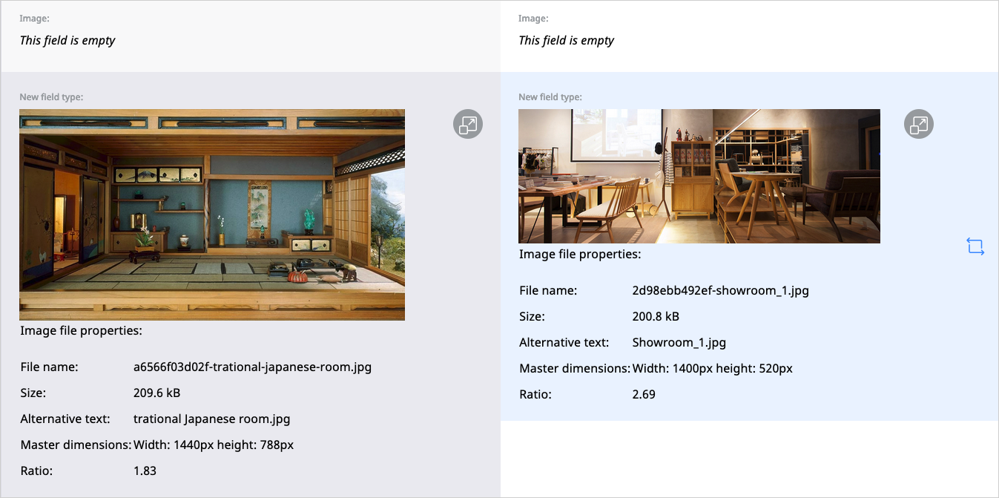

# Publishing content

When you publish a Content item, it is given a Location ID and placed in the Content tree.
After you click **Publish**, the Content item is validated and if any of the required Fields are not configured, you see a notification.
Once the Content item passes the validation, it is immediately available to the visitor.

Instead of instantly publishing you can also save, discard changes, [publish later](advanced_publishing_options.md#date-based-publishing) and [send for review](editorial_workflow.md).
All these options are available in the menu when you are in the edit mode.

### Publishing vs. saving

Clicking **Save** does not immediately publish the Content item.
Instead, it saves the new version of the content as a **draft**.
You can then keep on editing the same content and save it again when needed, or leave the editor by using the **X** icon in the upper left corner.

!!! caution

    Only selecting **Delete draft** removes the whole draft and all the work you have done on it.
    A discarded draft is removed instantly, not placed in the Trash, so it can't be restored.

Once you leave the editor after saving your draft, you can return to modify it, or create a new draft.
To edit an existing draft, go to the **Versions** tab and click the edit icon in the proper line.
When you select **Edit** in a Content item that has one or more open drafts, you will be asked which draft you want to continue working on.
You will also have the option to create a new draft based on the currently published version.

Note that you cannot edit an unpublished draft created by another user.

### Autosave

While you edit a Content item or product, [[= product_name =]] saves your work automatically to help you preserve the progress in an event of a failure.
To recover your work, open the most recent draft in the **Versions** tab of the Content item.
Alternatively, open the most recent draft of your work on the **My dashboard** page, the **Drafts** table.

Autosave is enabled by default, and set to save a draft every 60 seconds.
You can toggle autosave or change the time between saving attempts in **User settings**, by changing
the values in the **Autosave draft** and **Autosave interval** fields.

### Content versions

Content in the repository can have more than one version.
Each version is either published, archived, or a draft.

The **published version** is the version that is currently used on the website.
Every Content item can have only one published version at a time.

Whenever you edit and publish a Content item again, its previous published version becomes an **archived version**.
It is not available to the visitor and you cannot edit it, but you can create new drafts based on any archived version.

Finally, **drafts** are version that have not been published yet.

You can view all versions of a Content item in the **Versions** tab.

#### Comparing versions

You can compare two versions of the same Content item by clicking the compare icon
in the **Versions** tab:

Select the two version you want to compare in the drop-down menus at the top of the screen.

You can choose to view the comparison in two columns, side by side,
or in one column, with differences highlighted.

You can also compare media Field Types such as images.

!!! note

    Not all Field Types are available for comparison. You cannot preview the difference in the following Field Types:

    - Form
    - Landing Page
    - User account
