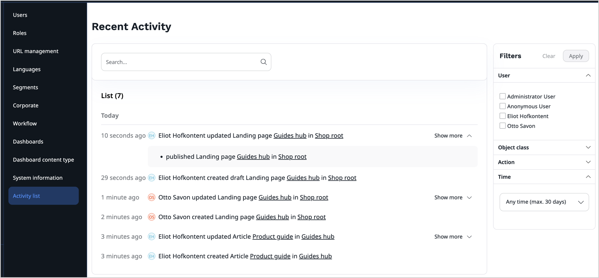
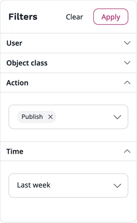
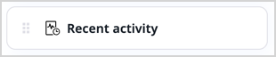
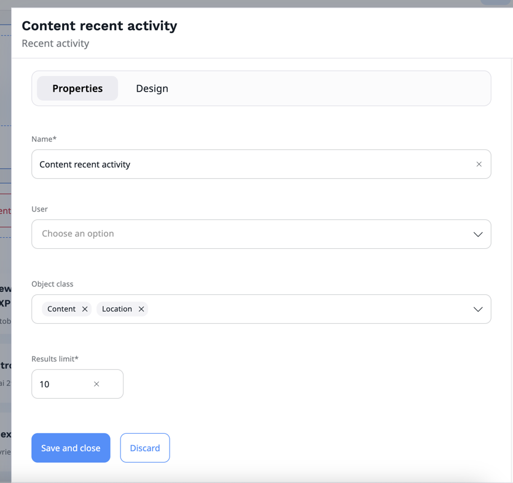
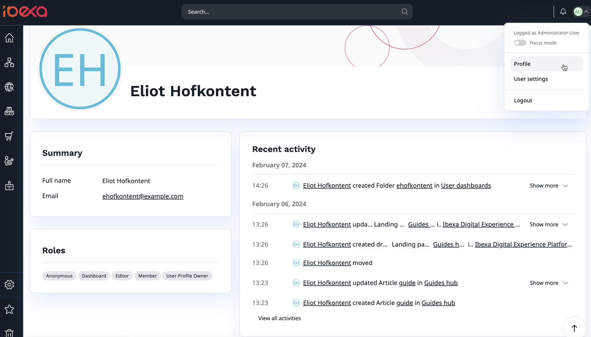

# Recent activity log [[% include 'snippets/experience_badge.md' %]] [[% include 'snippets/commerce_badge.md' %]]

## Activity list

In the Back Office, **Admin** -> **Activity list**, you can see a list of recent activity of all or selected users.

!!! note

    - To see the Admin menu, you must have the "Setup / Administrate" [permission](permission_system.md).
    - To see the Activity list, you must have the "Activity Log / Read" permission (this permission might be limitated to only see your own activity).

By default, the following actions are displayed:

- [Content](content_items.md) [create](create_edit_content_items.md#create-content-items), [publish](publish_instantly.md#publish-content-instantly), update, trash, recover, [delete](copy_move_hide_content.md#multi-file-move), delete translation, hide and reveal
- Location create, delete, [hide](manage_locations_urls.md#hide-locations), reveal, update, move, [swap](manage_locations_urls.md#swap-locations) and subtree copy
- Product [create](create_edit_product.md), update and delete
- Product variant [create](work_with_product_variants.md#generate-variants), update and [delete](work_with_product_variants.md#delete-variants)
- [Site](work_with_sites.md) [create](work_with_sites.md#create-a-website), [update](work_with_sites.md#edit-an-existing-website) and [delete](work_with_sites.md#delete-an-existing-website)

By default, log entries are kept 30 days.

Log entries are grouped by logical bonds like web requests, events, batches, or sessions.

### Filter activities

You can filter the activities to:

* follow the activity of selected users or user group,
* narrow the results to selected item types, or actions.

To do it, on the right side, in the **Filters** menu, choose selected filters, and click the **Apply** button. 
Click the **Clear** button to reset all the filters.

The following example shows, how to narrow the results by selecting **Action** and **Time** filters.
With these settings, activity list displays only `Publish` actions from `Last week` time period.

## Recent activity dashboard block [[% include 'snippets/experience_badge.md' %]] [[% include 'snippets/commerce_badge.md' %]]

You can add a **Recent activity** block to your [dashboard](discover_ui.md#dashboard).
To be able to customize a dashboard, you need the `dashboard/customize` policy.

You can set the block to display only activities of selected users, or concerning particular object classes.

For example, the following dashboard block focuses on Content and Location activity.

## User profile

A user profile displays recent activity from this user
(only if current user has permission to see own or other user activity log).

