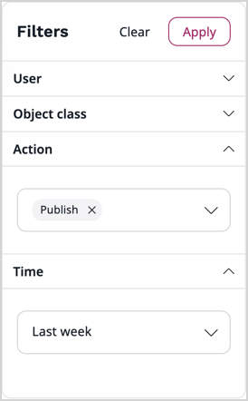

# Review recent user activity

[[= product_name =]] logs various operations on the repository and in the application.
If you have administrator permissions and your [user role](permission_system.md) has the **Activity Log / Read** permission, you can review the most recent activity log in the Back Office, the Admin tab.

Depending on the system configuration, activity logs may also be shown:

- on the Dashboard, the [Recent activity block](dashboard_block_reference.md#recent-activity-block)
- within the [user profile](../getting_started/get_started.md#view-and-edit-user-profile)

!!! note

    By default, log entries are kept for 30 days.
    This time can be modified through configuration.
    For more information, see [developer documentation]([[= developer_doc =]]/administration/recent_activity/recent_activity/#configuration-and-cronjob).

## View user activity in Back Office

In the Back Office, go to **Admin** -> **Activity list**, to see recent activity of all or selected users.

The following actions are displayed:

- [Content](content_items.md) create, create draft, publish, update, trash, recover, delete, delete translation, hide, and reveal
- [Location](manage_locations_urls.md#content-locations) create, delete, hide, reveal, update, move, swap, and subtree copy
- [Product](products.md) create, update, and delete
- [Product variant](work_with_product_variants.md) create, update, and delete
- [Site](work_with_sites.md) create, update, and delete

Log entries are grouped by logical bonds like web requests, events, batches, or sessions.

!!! note

    If your implementation requires that other actions are logged, see [custom log entry developer documentation]([[= developer_doc =]]/administration/recent_activity/recent_activity/#adding-custom-activity-log-entries).

### Filter activity

You can filter the actions to:

* follow the activity of a selected user or user group
* narrow down the results to selected item types or actions

To do it, in the **Filters** area, select filters of your choice, and click **Apply**.
Click **Clear** to reset all the filters.

For example, you can narrow down the results by selecting the **Action** and **Time** filters, so that the activity list displays actions only of the `Publish` type from `Last week`.

