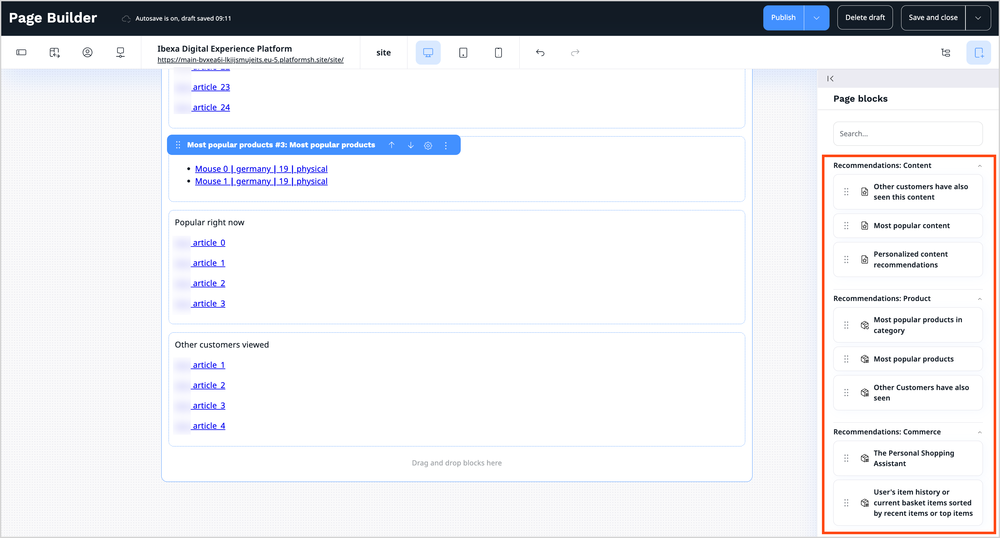
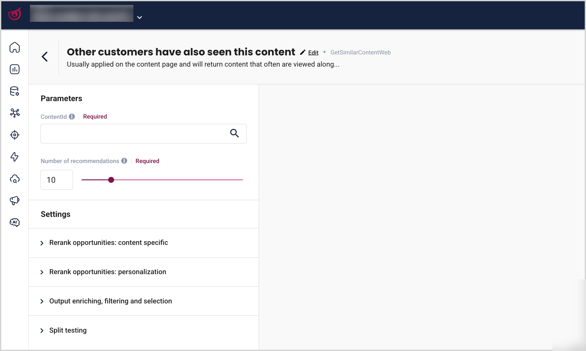

# Recommendation block reference

The [Raptor](https://www.raptorservices.com/) Integration introduces a set of recommendation blocks.
These blocks are available in the [Page Builder](create_edit_pages.md#page-builder-interface) and can be configured to control their behavior and output.

Each recommendation block corresponds to a specific Raptor module.
It's configurable in the [Raptor Control Panel](https://controlpanel.raptorsmartadvisor.com/) where parameters and settings can be modified.

In the Page Builder, only the required parameters for each block can be configured.
Additional, optional settings are available through the **Go to advanced settings in Raptor** link.
It redirects to the respective module configuration in the Raptor Control Panel, where these settings can be adjusted and saved.

Each Content, Product, and Commerce recommendation can be added to a landing page using blocks divided into categories:

## Recommendations: Content

The following blocks can be used to present content recommendations:

|Block|Description|
|-----|-----------|
|[Most popular content](#most-popular-content-block)|Highlights the most frequently viewed content.|
|[Other customers have also seen this content](#other-customers-have-also-seen-this-content-block)|Displays content viewed by other users with similar behavior.|
|[Personalized content recommendations](#personalized-content-recommendations-block)|Provides personalized content recommendations based on user behavior and preferences.|

### Most popular content block

Highlights the most trending or popular content that is most frequently viewed by users across the website.
It's defined by the calculation type, interaction type, and aggregation period.
It helps identify popular and relevant content items.

This block uses [GetPopularContentWeb](https://controlpanel.raptorsmartadvisor.com/pc/customer/tnt/product/web/module/GetPopularContentWeb) Raptor recommendation strategy.

On the **Properties** tab, set values in the following fields:

- **Name** – Enter a name for the page block.
- **Name displayed on page (optional)** - Enter a name fot the block to be displayed on page.
- **Recommendations limit** - Set the number of recommendations to be displayed (default = 4).

### Other customers have also seen this content block

Highlights content viewed by other users with similar behavior.
Usually applied on the content page, returns content that is often viewed together with the given content.
It increases the engagement of the customers by helping to identify related and relevant content.

This block uses [GetSimilarContentWeb](https://controlpanel.raptorsmartadvisor.com/pc/customer/tnt/product/web/module/GetSimilarContentWeb) Raptor recommendation strategy.

On the **Properties** tab, set values in the following fields:

- **Name** – Enter a name for the page block.
- **Name displayed on page (optional)** - Enter a name fot the block to be displayed on page.
- **Select content for recommendations** - Select content to be used for recommendations.
- **Recommendations limit** - Set the number of recommendations to be displayed (default = 4).

### Personalized content recommendations block

Generates complementary, personalized content tailored to each user based on their behavior and preferences.
Increases relevance and engagement through personalized suggestions.

This block uses [GetUserContentRecommendationsWeb](https://controlpanel.raptorsmartadvisor.com/pc/customer/tnt/product/web/module/GetUserContentRecommendationsWeb) Raptor recommendation strategy.

On the **Properties** tab, set values in the following fields:

- **Name** – Enter a name for the page block.
- **Name displayed on page (optional)** - Enter a name fot the block to be displayed on page.
- **Recommendations limit** - Set the number of recommendations to be displayed (default = 4).

## Recommendations: Product

The following blocks can be used to display product suggestions based on visitors’ browsing history:

|Block|Description|
|-----|-----------|
|[Most popular products](#most-popular-products-block)|Presents trending and highly popular products.|
|[Most popular products in category](#most-popular-products-in-category-block)|Presents trending and highly popular products.|
|[Other customers have also seen](#other-customers-have-also-seen-block)|Shows content or products also viewed by other customers.|

### Most popular products block

Presents products that are currently trending and widely popular among users.
It's defined by the calculation type, interaction type, and aggregation period.
Helps quickly identify top-performing and popular items.

This block uses [GetPopularItemsWeb](https://controlpanel.raptorsmartadvisor.com/pc/customer/tnt/product/web/module/GetPopularItemsWeb) Raptor recommendation strategy.

On the **Properties** tab, set values in the following fields:

- **Name** – Enter a name for the page block.
- **Name displayed on page (optional)** - Enter a name fot the block to be displayed on page.
- **Recommendations limit** - Set the number of recommendations to be displayed (default = 4).

Toggle the **Enable showing only available items** option on to display only products that are currently in stock.

### Most popular products in category block

Displays the most popular products within a selected category.
It's defined by the interaction type and aggregation period.
Helps identify most popular items within a specific category.

This block uses [GetPopularItemsInCategoryWeb](https://controlpanel.raptorsmartadvisor.com/pc/customer/tnt/product/web/module/GetPopularItemsInCategoryWeb) Raptor recommendation strategy.

On the **Properties** tab, set values in the following fields:

- **Name** – Enter a name for the page block.
- **Name displayed on page (optional)** - Enter a name fot the block to be displayed on page.
- **Product category** - Select product category.
- **Recommendations limit** - Set the number of recommendations to be displayed (default = 4).

Toggle the **Enable showing only available items** option on to display only products that are currently in stock.

### Other customers have also seen block

Shows products viewed by users with similar behavior.
Usually applied on the product page, returns items that are often viewed together with the given product.
Enhances user experience by suggesting related products.

This block uses [GetSimilarItemsWeb](https://controlpanel.raptorsmartadvisor.com/pc/customer/tnt/product/web/module/GetSimilarItemsWeb) Raptor recommendation strategy.

On the **Properties** tab, set values in the following fields:

- **Name** – Enter a name for the page block.
- **Name displayed on page (optional)** - Enter a name fot the block to be displayed on page.
- **Product code** - Enter a product code for a base product or select base product from the Product Catalog.
- **Recommendations limit** - Set the number of recommendations to be displayed (default = 4).

Toggle the **Enable showing only available items** option on to display only products that are currently in stock.

## Recommendations: Commerce

The following blocks can be used to show recommendations based on visitors purchase history (buy and basket events):

|Block|Description|
|-----|-----------|
|[The Personal Shopping Assistant](#the-personal-shopping-assistant-block)|Assists users by suggesting relevant products in real time based on their activity.|
|[User's item history or current basket items sorted by recent items or top items](#users-item-history-or-current-basket-items-sorted-by-recent-items-or-top-items-block)|Displays the user’s item history or current basket, sorted by recent or top items.|

### The Personal Shopping Assistant block

Provides real-time product recommendations based on user behavior.
The web personal shopping assistant recommends items at each step of the customer journey, with a short-term focus.
It helps users discover relevant items while browsing by providing personalized recommendations based on their current behavior.

This block uses [GetUserItemRecommendationsWeb](https://controlpanel.raptorsmartadvisor.com/pc/customer/tnt/product/web/module/GetUserItemRecommendationsWeb) Raptor recommendation strategy.

On the **Properties** tab, set values in the following fields:

- **Name** – Enter a name for the page block.
- **Name displayed on page (optional)** - Enter a name fot the block to be displayed on page.
- **Product id (optional)** - Add or select base product.
- **Recommendations limit** - Set the number of recommendations to be displayed (default = 4).

Toggle the **Enable showing only available items** option on to display only products that are currently in stock.

### User's item history or current basket items sorted by recent items or top items block

Shows the user’s past or current basket items, sorted by recent activity or top items.
Makes it easier to find and review previously viewed or added products.
This module can be configured to return recently viewed items, most interacted items, or items currently in the basket.

This block uses [GetUserItemHistoryWeb](https://controlpanel.raptorsmartadvisor.com/pc/customer/tnt/product/web/module/GetUserItemHistoryWeb) Raptor recommendation strategy.

On the **Properties** tab, set values in the following fields:

- **Name** – Enter a name for the page block.
- **Name displayed on page (optional)** - Enter a name fot the block to be displayed on page.
- **Recommendations limit** - Set the number of recommendations to be displayed (default = 4).

Toggle the **Enable showing only available items** option on to display only products that are currently in stock.

!!! tip

    For the list of all available blocks in Page Builder, see [Block reference](block_reference.md) page.
