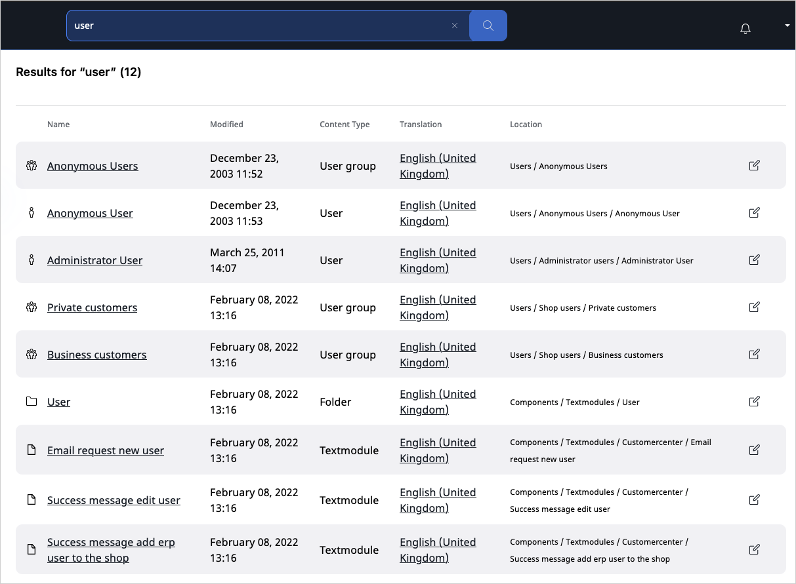

# Searching

## Basic search

You can enter a search keyword and the application checks all the searchable Fields and returns a list of search results that contain the keyword.

You can also select a language to search in.
The results will contain Content items that are translated into this language.

The result list also shows which languages the Content item is translated to:

## Simplified filtered search

Simplified filtered search allows you to filter by:

 - Content Type
 - Section
 - Modified date
 - Created date
 - Creator
 - Subtree

All new or custom Content Types and Sections are automatically added to the drop-down filter lists.

!!! note

    With further development, new filters as well as support for facets will be added.
