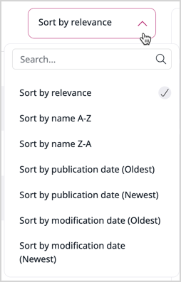

# Search for content

You can enter a search keyword and the application checks all the searchable Fields and returns a list of search results that contain the keyword.

TODO: Update following screenshot to have the sorting menu visible and several translations.

Everywhere in the Back Office, completion suggestions are proposed while typing in the search box.
If a suggestion is what you're looking for, click on it in the suggestion drop-down.
If no suggestion correspond to your search, press Enter key or click "View all results".

If several languages are available, you can select a language to search in at the top of the left "Filters" menu.
The results will contain Content items that are translated into this language.
The result list also shows which languages the Content item is translated to.
[More about this Filters menu below](#filtered-search).

By default, the results are sorted by decreasing relevance. Thanks to the drop-down menu on top-right, you can sort them by name, publication date or modification date.

## Filtered search

Filtered search allows you to filter by:

- Language (if there is several languages)
- Content Type
- Modified date
- Created date
- Creator
- Section
- Subtree

All new or custom Content Types, Sections and Languages are automatically added to the drop-down filter lists.

A Content item count is indicated between parenthesis for Content type and section filters (if your search engine allows faceting, unlike the Legacy one).

Select your filters then click "Apply" button to update results accordingly.
Reset and remove all filters by clicking "Clear" button.

