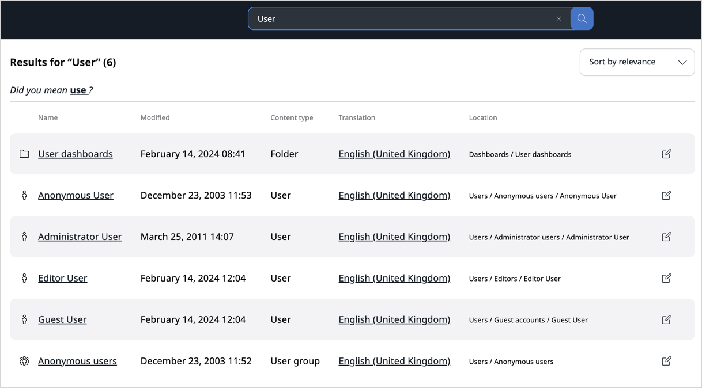

# Search for content
You can enter a search keyword and the application checks all the searchable Fields and returns a list of search results that contain the keyword.

You can also select a language to search in.
The results will contain content items that are translated into this language.

The result list also shows which languages the content item is translated to.

## Filtered search

Filtered search allows you to filter by:

 - Content type
 - Section
 - Modified date
 - Created date
 - Creator
 - Subtree

All new or custom content types and Sections are automatically added to the drop-down filter lists.

