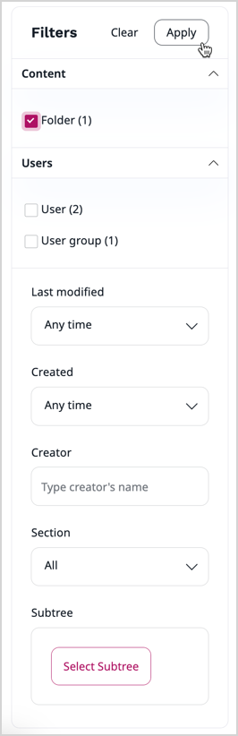

# Search for content

You can enter a search keyword and the application checks all the searchable Fields and returns a list of search results that contain the keyword.

Everywhere in the Back Office, completion suggestions are proposed while you type in the search box.
In addition to clicking in the search box, you can also move focus to it by using the keyboard shortcut `Ctrl+/` on Windows/Linux, or `Cmd+/` on macOS.

- If a suggestion is what you're looking for, to use it, click on it in the suggestion drop-down, or use `down` and `up` keys to highlight it, and then press the `Enter` key.

- If no suggestion corresponds to your search, press the `Enter` key or click **View all results**.

On the results page, if several languages are available, you can select a language to search in at the top of the left **Filters** menu.
The results contain Content items that are translated into this language.
The result list also shows which languages the content item is translated to.

By default, the results are sorted by decreasing relevance.
By selecting an option from a drop-down menu in the top right corner, you can sort them by name, publication date, or modification date.

The search engine not only displays suggestions, but also supports spell checking.
If there is a typo in your search phrase, the search engine suggests a related, acuurate term.

## Filtered search

Filtered search allows you to filter by:

- Language (if more than one language available)
- Content type
- Modified date
- Created date
- Creator
- Section
- Subtree

All new or custom content types, sections and languages are automatically added to the drop-down filter lists.

Depending on the system configuration, a Content item count can be indicated for content type and section filters.

Select your filters, then click **Apply** to update the results.
Click **Clear** to reset and remove all filters.

