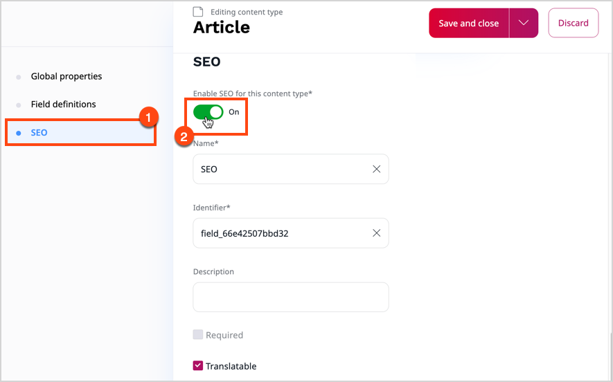

# Work with SEO

For the Search Engine Optimization (SEO) feature to help you optimize the searchability and visibility of your content, you must enable it first, and then, define the contents of individual tags.

To do it, make sure you can [edit content types](../content_management/content_model.md#content_types).

## Enable SEO

1. In the left panel, go to **Content** -> **Content types** and select a content type group by clicking its name, for example, **Content**.
2. [Create a new content type](create_edit_content_types.md) or click the edit icon next to the content type that you want to modify.
3. Go to the **SEO** section and switch the **Enable SEO for this content type** toggle.
4. To save your changes, click **Save and close**, or **Save** to continue editing.

## Define Meta tags

When you edit the content type definition, in the **SEO** section, go to the **Meta tags** area, and provide values for the following meta tags:

- **Title**
- **Description**
- **Keywords**
- **Canonical**

To learn more about the function of each of the tags, see [Meta tags](seo.md#meta-tags).

When you populate the SEO fields, you can create patterns using a schema with attributes which correspond to identifiers of fields that make up the content type.
As a result, SEO tags are filled in at content item generation phase with specific contents of such fields. For example, if you enter `<title>.<format> - <author>` as a value of the **Title** tag, the search engine returns `Silmarillion. Illustrated edition - J.R.R. Tolkien`.

You can also fine-tune the way your content is presented when linked from a social media platform by populating the social media-specific meta tags in the exact same way:
fill in fields in the **OpenGraph** and **Twitter** sections with patterns to configure the Facebook and Twitter presentation respectively.
If you leave these fields blank, social media snippets are generated based on the definitions that you provided in the search engine meta tag fields.

## Preview meta tags of content item

You can preview what the actual SEO tags for a specific content item can look like when they're passed to a search engine or social media platform.

1. In content tree, navigate to the content item.
2. On the content item details screen, click the **SEO** tab.
3. Review the contents of the **resolved** fields.

`

## Override meta tags of content item

When you want a specific content item to appear in search results differently than the other items of a specific content type, you can override the contents of SEO tags.
You might want, for example, to add a shout out to the title after the author of content receives a literary prize.

1. In content tree, navigate to the content item, and click the **Edit** button.
2. Go to the **SEO** section and, in relevant fields, replace the patterns that originate from the [content type definition](#define-meta-tags).
3. **Publish** your changes, **Save and close** or **Delete draft** to return to the content tree.

You can either use plain text or patterns, like in the case of content types.