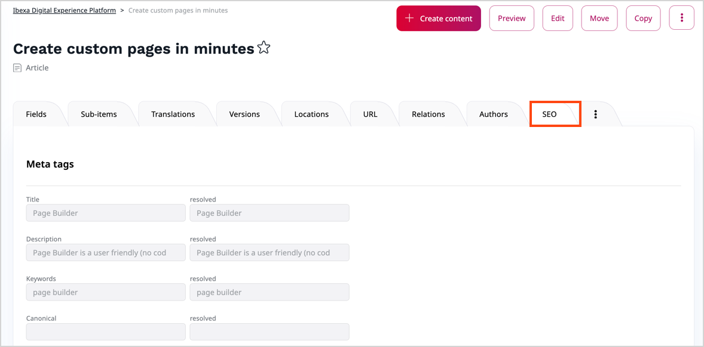

# Work with SEO

For the Search Engine Optimization (SEO) feature to help you optimize the searchability 
and visibility of your content, you must enable it first. 
Then you must define the contents of individual tags.

To do it, you must be able to [edit Content Types](../site_organization/organizing_the_site.md#content-types).

## Enable SEO

1. Click **Content** to display content management options, and then **Content Types**.
2. Drill down the content group and click the edit icon next to the Content Type that you want to modify.
3. Go to the **SEO** section and select the **Enable SEO for this content type** toggle.
4. Click **Save** to save your changes.

## Define Meta Tags

When you edit the Content Type definition, in the **SEO** section, go to the 
**Meta tags** area, and provide values for the following meta tags:

- **Title** - Represents the title of the Content item that you want to promote
- **Description** - Represents a summary of your Content item
- **Keywords** - Keywords are ideas and topics that define what your content is about
- **Canonical** - Tells search engines which copy of content is the original that should appear in search results

When you populate the SEO fields, you can create patterns by using a schema with 
attributes which correspond to identifiers of fields that make up the Content Type.
As a result, SEO tags are filled in at Content item generation phase with specific 
contents of such fields. For example, if you enter `<title>.<format> - <author>` 
as a value of the **Title** tag, the search engine will return 
`Silmarillion. Illustrated edition - J.R.R. Tolkien`.

`

You can also fine-tune the way your content is presented when linked from 
a social media platform by populating the social media-specific meta tags 
in the exact same way: 
Fill in fields in the **OpenGraph** and **Twitter** sections with patterns 
to configure the Facebook and Twitter presentation respectively. 
<!--If you leave these fields blank, social media snippets are generated based on 
the definitions that you provided in the search engine meta tag fields.-->

## Preview meta tags of Content item

You can preview how the actual SEO tags for a specific Content item 
will look like when they are passed to a search engine or social media platform.

1. In Content Tree, navigate to the Content item.
2. On the Content item details screen, go to the SEO tab.
3. Review the contents of the **resolved** fields.

`

## Override meta tags of Content item

When you want a specific Content item to appear in search results differently than 
the other items of a specific Content Type, you can override the contents of SEO tags.
You might want, for example, to add a shout out to the title after the author of content 
receives a literary prize.

1. In Content Tree, navigate to the Content item, and click the **Edit** button.
2. Go to the **SEO** section and, in relevant fields, replace the patterns that 
originate from the Content Type definition. 

You can either use plain text or patterns, like in the case of Content Types. 
