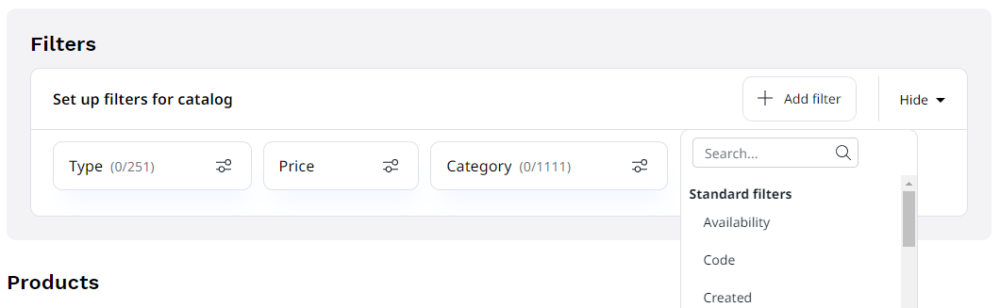

# Catalogs

You can create catalogs, to build special catalogs, for example for B2B and B2C uses,
for retailers and distributors or for different regions.
Catalogs contain a selection of products from the system.

## Creating catalogs

To create a catalog:

1. In the **Product catalog** section in the menu, select **Catalogs**.
2. Click **Create**.
3. Enter the name and identifier for the catalog.
4. Select filters that decide which products are included in the catalog.
5. Click **Create**.

### Catalog filters

You can add the following filters to select products for a catalog from the **Add filter** menu:

- Category
- Created (date when the product was created)
- Availability
- Code
- Price (in selected currency, with the option to set minimum and maximum price)
- Type
- and additionally, filters based on all configured product attributes

The **Products** section at the bottom of the catalog screen shows a preview of which products fit the current filters.
The list is updated automatically when you add or modify filters.
You can also remove selected filters there.

You can view all products in a catalog in its **Products** tab:

## Copying catalogs

You can copy existing catalogs, for example to create a variant version of an offer with slightly differing filters.
To do so, in the catalog's view screen click **Copy**.

You can then modify the copied catalog (for example, change its name or fine-tine filters), and save the updated version.
