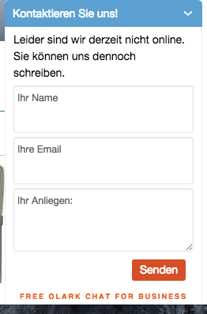
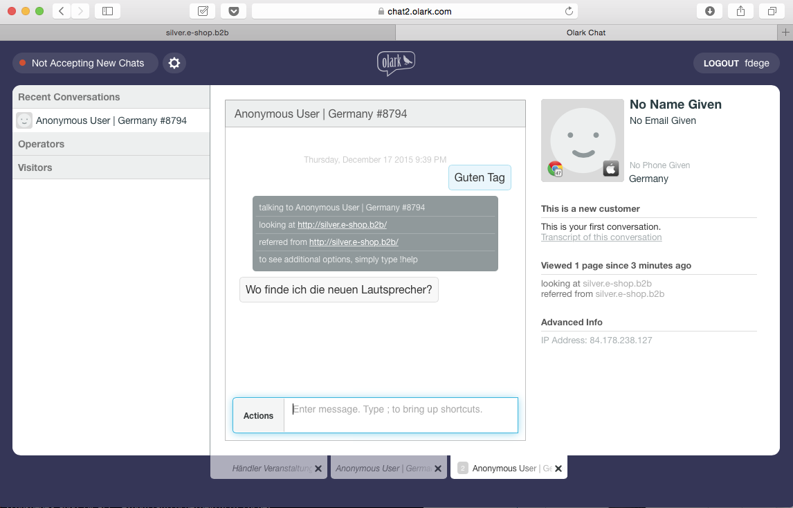
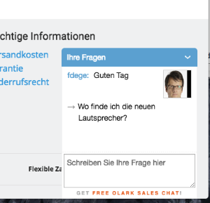
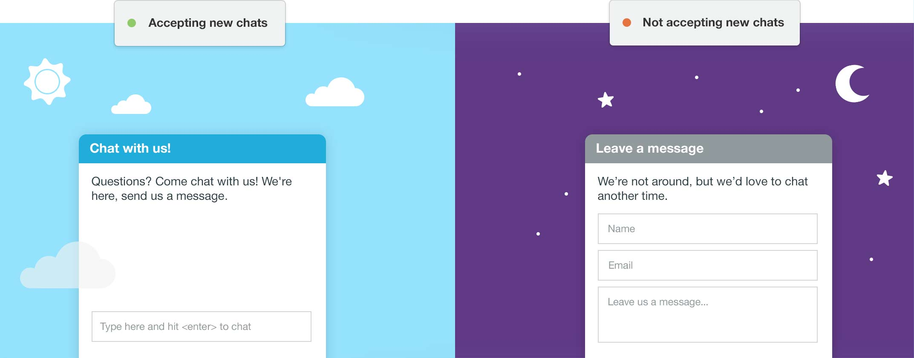
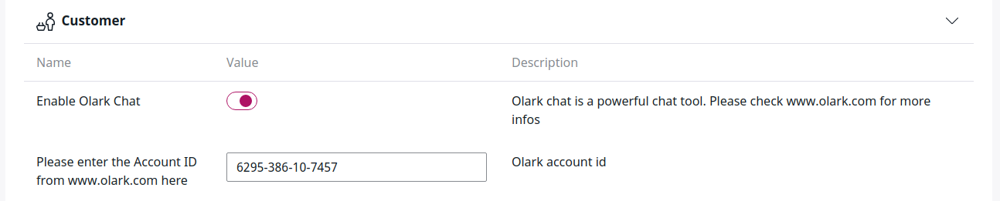
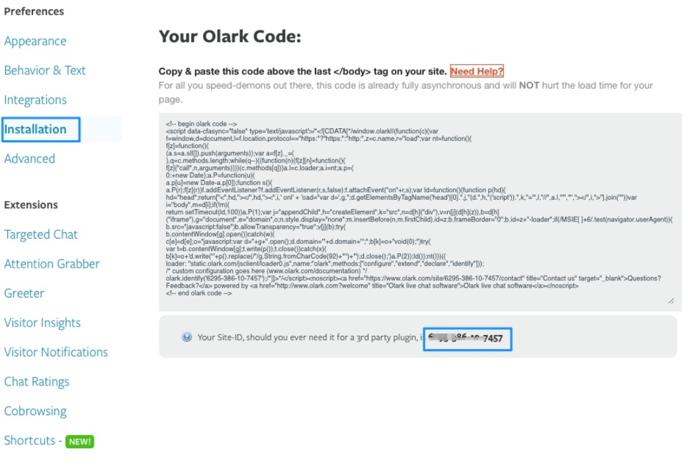

# Olark chat tool

Olark is a third-party chat tool that you can enable as a plugin.

The shop can forward the name of a user (if logged in) to the service employee.
Besides a chat functionality the service employee can assist the customer e.g. in pointing them to the correct place in the shop.

If no support employee is available, the conversion is sent by email.

!!! note

	Some features are available with a special contract only.
	See [Olark plans](https://www.olark.com/pricing) for more information.

### Online/Offline

The chat windows indicates whether a salesperson is available or not.

If a salesperson is online, the chat indicates this and it is possible to display an icon or an image of the salesperson.

### Change the text inside the chat

You can change and translate all texts and labels used in the chat.

### Using the chat for sales

Olark offers a web interface where chats can be handled.

In addition, local chat clients can be used as well, e.g.:

- iChat
- XMMP Clients
- mobile apps

### Restrict access for chat
	
You can restrict the chat tool to:

- specific products
- specific customers or customer group
- from a given basked amount
- given countries

The chat can be displayed after the user has been on a page for a given time.

### Information about the user

Depending on your privacy rules, information about the user can be displayed in the chat, such as:

- Geo information
- Visited pages
- Name and company if logged in
- Amount of the basket
- Customer number

### Design of the chat tool

You can modify the design of the plugin in Olark backend.

### Groups of salespersons

A chat can be assigned to a group of users as well.

### Alerts and options for employees

You can set up alerts such as sounds or desktop notifications. Olark can be connected to internal tools such as Jabber.

A user can set their status to online / away.

### Co-browsing

Olark supports [co-browsing](https://www.olark.com/help/cobrowsing) if a customer needs support.

Co-browsing is supported by IE8+, Firefox, Safari, Chrome, and Opera, as well as Safari for iOS devices.

### Chat commands
	
Olark supports multiple chat functions. For a complete list see [Olark documentation.](https://www.olark.com/help/commands)

Important commands:

- `tag` - tags a chat to label conversations 
- `transfer` - transfers a conversation to another operator
- `push` - sends a visitor to a different website URL
- `name` - gives a website user a name
- `case` - pushes the transcript for your chat into your CRM 
- `send` - enables you to forward a chat transcript by email during a chat 
- `feedback` - enables you to send a Chat Rating to the visitor

## Configuration

Create an account on [www.olark.com.](http://www.olark.com) You can choose a free version or another option as required.
We recommend the paid version since it offers support features such as co-browsing.

Configure Olark in the **Customer** section of configuration settings:

Change the following settings:

- Enable the service
- Enter the Olark Account ID

You can find the Olark Account ID in the "Installation" section.

After storing the configuration you should see a chat tool at the bottom of your page.

In the settings section on [www.olark.com](http://www.olark.com) you can also configure:

- the location where the chat should appear
- translations
- color
- a photo of the support employee

See [Olark documentation](https://www.olark.com/api) for more details.
