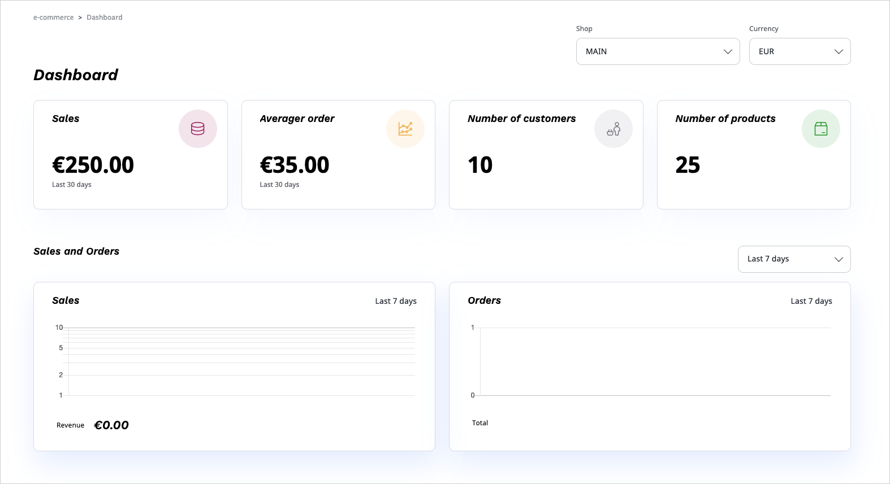

# Cockpit [[% include 'snippets/commerce_badge.md' %]]

The Cockpit shows the most important information for the shop owner referring to the installation.

## Overview

An overview section of the Cockpit presents the following data:

- Technical subsection
    - HDD usage
    - Server load
    - ERP Status
- Active shopping carts (in last 30 minutes)
- Total no. of customers
- Total no. of products

## Sales and Orders

The **Sales and Orders** tab presents data about:

- Sales - shows orders value in time and total value of sales
- Orders - shows number of orders in total and over time

You can select a specific date range or one of predefined date ranges.

## Products and sales

The **Products and sales** tab shows information about:

- Bestsellers (top 20)
- Last orders (last 365)
- Best clients (top 20)

The **Last orders** and **Best clients** tables are only visible to users who have the "Siso policy / Read customers and orders" Policy.
See [Permissions](permissions.md) for more information.

## Search

The **Search** tab offers the following statistics:

1\. Top search terms

Lists top 50 search terms including how often they are searched for and how many hits (average) they have.

2\. Last search terms

Lists the latest 50 search terms ordered by date.

3\. Most searched terms with less hits

Shows search terms that did not lead to a result and the number of times they were searched for.
