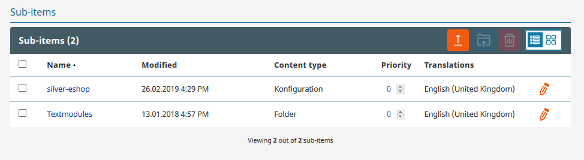

# Components

**eCommerce** > **Components**. contains two sections: eCommerce Configuration settings and text modules.

Do not edit the "silver.eShop Configuration settings" Content item manually.
It is updated by the changes from the configuration settings.

For more information about text modules, see [Translations](translations.md).
