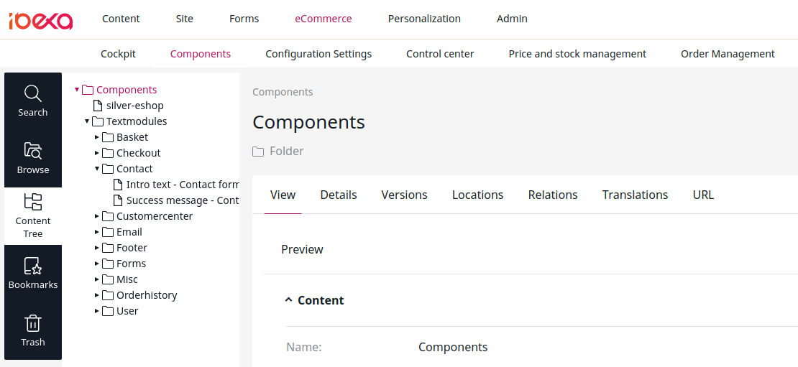

# Components [[% include 'snippets/commerce_badge.md' %]]

**eCommerce** > **Components** contains text modules responsible for translations of shop text.

!!! caution

    Do not edit the "silver-eshop" Content item manually.
    It handles configuration settings and is updated by the changes from the **Configuration** section.

For more information about text modules, see [Translations](translations.md).
