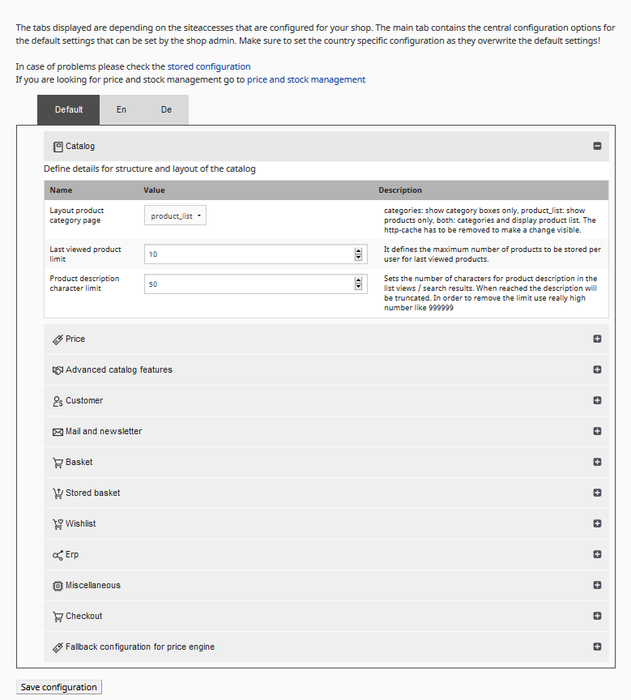
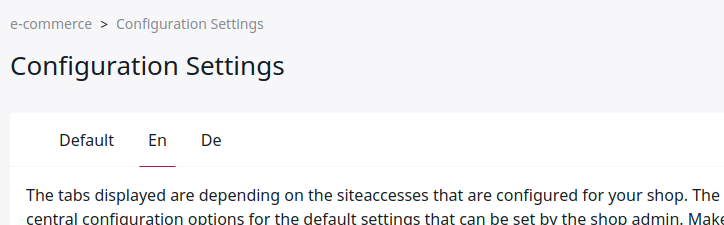

# Configuration settings [[% include 'snippets/commerce_badge.md' %]]

To change configuration settings for the shop, go to **eCommerce** > **Configuration settings**.

!!! caution

    Settings defined in the Back Office always override the configuration in YAML files.

## Catalog

The catalog section defines details for structure and layout of the catalog.

|Name|Stored Configuration File|Default|Description|
|--- |--- |--- |--- |
|Layout product category page|siso_core.default.category_view: product_list|product_list|Changes the layout for the product category page. `category` shows category boxes only, `product_list` shows products only, `both` shows both categories and products. HTTP cache has to be cleared to make changes visible.|
|Last viewed product limit|silver_eshop.default.last_viewed_products_in_session_limit: 10|10|The maximum number of products to be stored per user for last viewed products.|
|Product description character limit|silver_eshop.default.catalog_description_limit: 50|50|The number of characters for product description in the list views / search results. When the limit is reached, the description will be truncated.|

## Price

|Name|Stored Configuration File|Default|Description|
|--- |--- |--- |--- |
|Last currency rate change||empty|When the conversion rate has last changed.|
|Automatic currency conversion||False|If no price is set up for this currency, the shop can calculate the price using a conversion rate from the configuration.|
|Currency conversion rate|||The conversion rate between currencies.|
|Default currency|siso_core.default.standard_price_factory.fallback_currency: EUR|EUR|Used as currency for the shop (e.g. per SiteAccess).|
|Base currency|siso_core.default.standard_price_factory.base_currency: EUR|EUR|Base currency of the shop in general (used for the fields "product unit price" and "fallback shipping price". The base currency is used for the automatic currency conversion).|
|Price providers for product listing page|siso_price.default.price_service_chain.product_list: - siso_price.price_provider.shop - siso_price.price_provider.remote|shop|Price calculation engines used for generating prices and stock information. `siso_price.price_provider.shop` indicates the price engine in the shop, `siso_price.price_provider.remote` indicates ERP. This configuration works as a chain, so if the first engine fails, the second one is used as a fallback (e.g. if ERP is not available). Price calculations in ERP systems may cause slower responses from the system, depending on the specific complexity.|
|Price providers for product detail page|siso_price.default.price_service_chain.product_detail: - siso_price.price_provider.shop - siso_price.price_provider.remote|shop|Shop or remote.|
|Price providers for product sliders|siso_price.default.price_service_chain.slider.product_detail: - siso_price.price_provider.shop - siso_price.price_provider.remote|shop|Shop or remote.|
|Price providers for basket|siso_price.default.price_service_chain.basket: - siso_price.price_provider.shop - siso_price.price_provider.remote|shop|Shop or remote.|
|Price providers for editing variants|siso_price.default.price_service_chain.basket_variant: - siso_price.price_provider.shop - siso_price.price_provider.remote|shop|Shop or remote.|
|Price providers for stored baskets lists|siso_price.default.price_service_chain.stored_basket: - siso_price.price_provider.remote - siso_price.price_provider.shop|shop|Shop or remote.|
|Price providers for whishlist|siso_price.default.price_service_chain.wish_list: - siso_price.price_provider.shop - siso_price.price_provider.remote|shop|Shop or remote.|
|Price providers for quickorder (click on update)|siso_price.default.price_service_chain.quick_order: - siso_price.price_provider.shop - siso_price.price_provider.remote|shop|Shop or remote.|
|Price providers for quickorder (product preview via Ajax)|siso_price.default.price_service_chain.quick_order_line_preview: - siso_price.price_provider.shop - siso_price.price_provider.remote|shop|Shop or remote.|
|Price providers for comparison lists|siso_price.default.price_service_chain.comparison: - siso_price.price_provider.remote - siso_price.price_provider.shop|shop|Shop or remote.|
|Price providers for search lists|siso_price.default.price_service_chain.search_list: - siso_price.price_provider.remote - siso_price.price_provider.shop|shop|Shop or remote.|
|Price provider for bestseller list|siso_price.default.price_service_chain.bestseller_list: - siso_price.price_provider.shop - siso_price.price_provider.remote|shop|Shop or remote.|

## Advanced Catalog Features 

|Name|Stored Configuration File|Default|Description|
|--- |--- |--- |--- |
|Disable ordering for discontinued products|siso_basket.default.discontinued_products_listener_active: true|True|If enabled, discontinued and out-of-stock products cannot be ordered.|
|Check packaging units and adjust quantity of discontinued products|siso_basket.default.discontinued_products_listener_consider_packaging_unit: true|True|If enabled, the shop modifies the quantity of discontinued products ordered by a user automatically to the next packaging unit.|

## Basket

|Name|Stored Configuration File|Default|Description|
|--- |--- |--- |--- |
|Duration of storing anonymous baskets|ses_basket.default.validHours: 120|120|How many hours anonymous baskets are stored for.|
|Update product data after this time|ses_basket.default.refreshCatalogElementAfter: '1 hours'|1 hours|Th time product data is cached in the basket for. Use a "1 hour" syntax.|
|Display stock as a column|ses_basket.default.stock_in_column: true|True|True - display in column, False - display inline (in product name column).|
|Description character limit|ses_basket.default.description_limit: 50|50|Number of characters that are visible in the description field.|
|Enable additional comment line for basket|ses_basket.default.additional_text_for_basket_line: false|False|If enabled, the customer can add a comment to each line in the basket or quick order.|
|Max. chars for the additional comment line|ses_basket.default.additional_text_for_basket_line_input_limit: 30|30|ERP often has a restriction and may not support long comments. This can lead to errors during the ordering process.|

## Stored basket

|Name|Stored Configuration File|Default|Description|
|--- |--- |--- |--- |
|Display stock as a column|ses_stored_basket.default.stock_in_column: true|True|True - display in column, False - display inline (inside product name column).|
|Description character limit|ses_stored_basket.default.description_limit: 50|50|Number of characters that are visible in the description field.|

## Wishlist

|Name|Stored Configuration File|Default|Description|
|--- |--- |--- |--- |
|Description character limit|ses_wishlist.default.description_limit: 50|50|Number of characters that are visible in the description field|

## ERP

Defines the details of data exchange and processes between your shop and your ERP.
ERP integration requires a Web.Connector license or another webservice interface between ERP and the shop.

|Name|Stored Configuration File|Default|Description|
|--- |--- |--- |--- |
|Default Country for Template Debitor|siso_core.default.template_debitor_country: DE|DE|Which country is used as a default. Use the country code such as "DE" for Germany.|
|Login with Customer Number|siso_core.default.enable_customer_number_login: false|False|Whether the login process includes a field for providing customer number.|
|Use a template debitor number for this shop|siso_core.default.use_template_debitor_customer_number: true|True|A template debitor customer number is used if a customer does not have a customer number from the ERP. Template debitor customer numbers can be defined for each country.|
|Use a template contact number for this shop|siso_core.default.use_template_debitor_contact_number: true|True|A template contact number is used if a customer does not have a customer and contact number from the ERP. Template contact numbers can be defined for each country.|
|price_requests_without_customer_number/config|siso_core.default.price_requests_without_customer_number: true|True|Whether a price request is sent to the ERP without customer number. A template debitor is used to calculate prices.|
|Recalculate prices using the ERP after|ses_basket.default.recalculatePricesAfter: '3 hours'|True|Information from the ERP is cached to reduce the traffic towards the ERP. Use a "1 hour" syntax.|
|Variants handling in the ERP|silver_eshop.default.erp.variant_handling: SKU_ONLY|SKU_ONLY|Handling of variant products SKU_ONLY - if the ERP system uses different SKUs per variant. SKU_AND_VARIANT - if the ERP system uses a combination of SKU and variant code for variants.|
|URL of the Web-Connector|siso_erp.default.web_connector.service_location:|-|The URL points to the Web.Connector installed by the ERP system. Use an HTTPS connection and make sure that the shop can access this IP and port only.|
|User name (configured per Web-Connector)|silver_eshop.default.webconnector.username: admin|admin|User name for communication with the Web.Connector service.|
|Password (configured per Web-Connector)|silver_eshop.default.webconnector.password: passwo|passwo|Password for communication with the Web.Connector service.|
|SOAP Web-Service timeout in seconds|silver_eshop.default.webconnector.soapTimeout: 5|5|Timeout (web service) for communication with the Web.Connector in seconds.|
|Timeout towards the ERP-System in seconds|silver_eshop.default.webconnector.erpTimeout: 5|5|Timeout (ERP) for communication with the Web.Connector in seconds.|

## Miscellaneous

|Name|Stored Configuration File|Default|Description|
|--- |--- |--- |--- |
|Number of bestsellers displayed on bestseller page|siso_core.default.bestseller_limit_on_bestseller_page: 6|6|The limit of bestsellers that are displayed.|
|Number of bestsellers displayed on catalog pages|siso_core.default.bestseller_limit_on_catalog_page: 6|6|The limit of bestsellers that are displayed.|
|Number of bestsellers displayed in a slider|siso_core.default.bestseller_limit_in_silver_module: 6|6|The limit of bestsellers that are displayed.|
|Threshold bestseller|siso_core.default.bestseller_threshold: 1|1|How often a product has to be bought to count as a bestseller.|

## Checkout

Configure your payment and shipping methods. Paypal requires an account.

|Name|Stored Configuration File|Default|Description|
|--- |--- |--- |--- |
|Payment method "PayPal"|siso_checkout.default.payment_method.paypal_express_checkout: true|True|Enables PayPal in checkout.|
|Payment method "invoice"|siso_checkout.default.payment_method.invoice: true|True|Enables invoice in checkout.|
|Shipping method "standard"|siso_checkout.default.shipping_method.standard: true|True|Enables shipping method standard in checkout.|
|Shipping method "express"|siso_checkout.default.shipping_method.express_delivery: true|True|Enables shipping method express in checkout.|

## Fallback configuration for price engine

Fallback configuration for price engine. It is used, if no shipping costs are set in [price and stock management](manage_prices_and_stock.md).

|Name|Stored Configuration File|Default|Description|
|--- |--- |--- |--- |
|Fallback costs for shipping|siso_local_order_management.default.shipping_cost: ''|-|Shipping cost in shop currency if free shipping limit is not reached.|
|No shipping costs for orders from amount|siso_local_order_management.default.shipping_free: ''|-|Free shipping limit in shop currency.|
|Fallback VAT Code for shipping costs|siso_core.default.shipping_vat_code: '19'|19|Used for calculating the VAT part for shipping.|

## Configuration for countries/site accesses

For some settings the shop requires a country-specific configuration.

