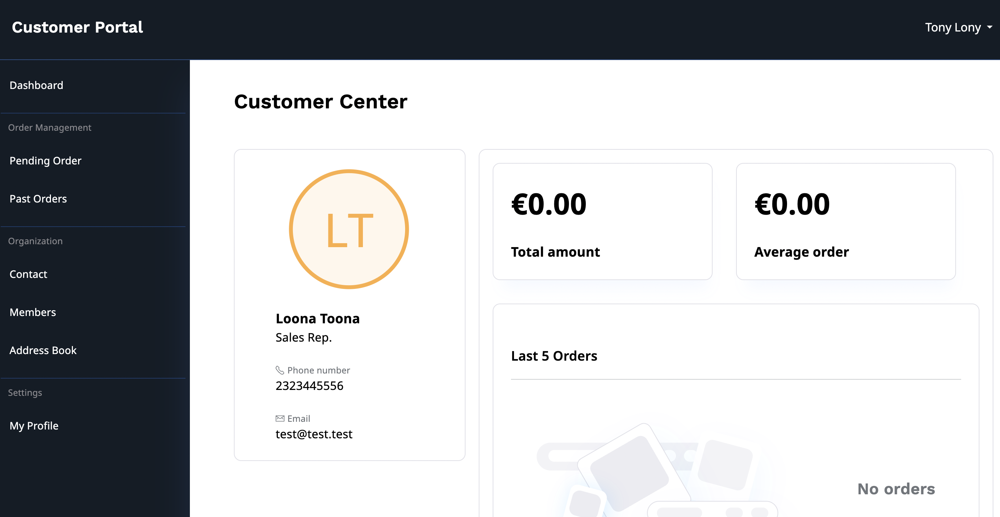
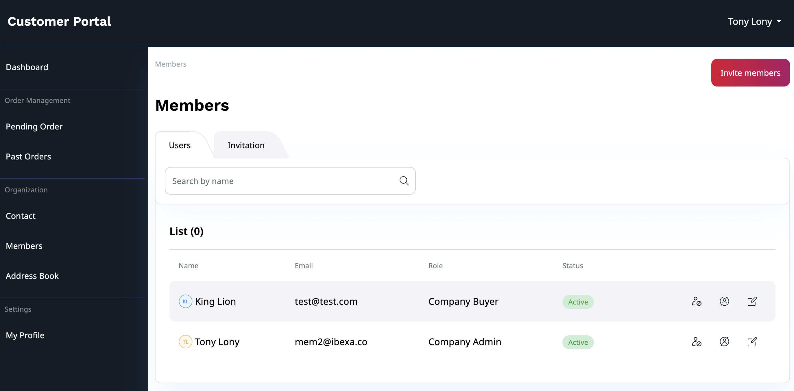
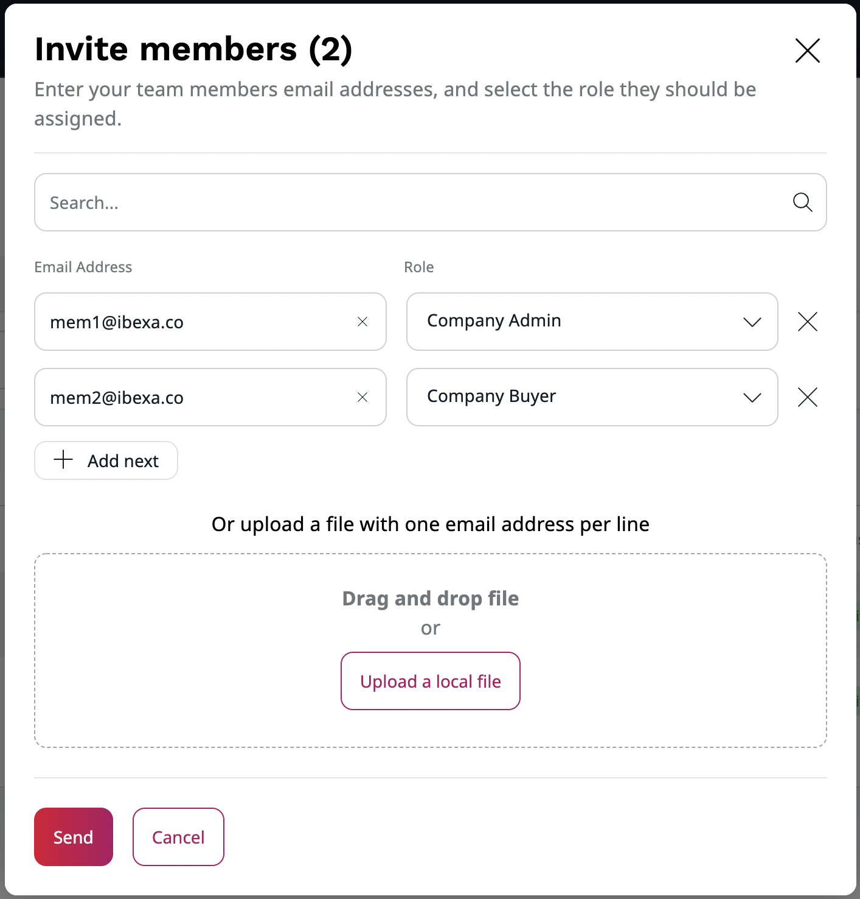
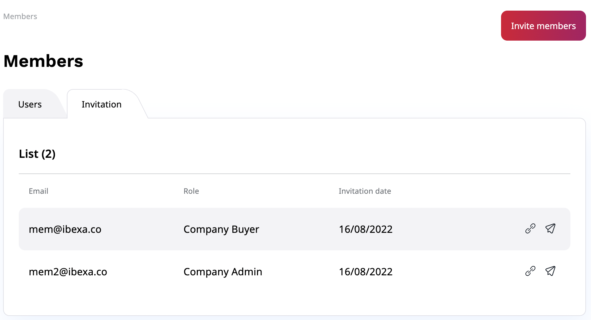
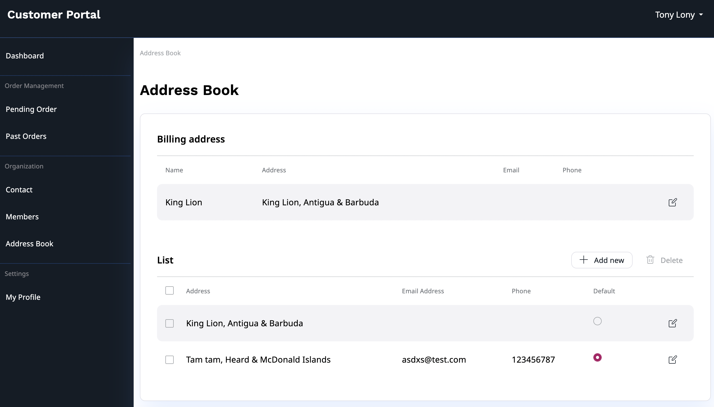

# Customer Portal account [[% include 'snippets/experience_badge.md' %]]

Customer Portal allows you to create and manage your business account.
With this feature, you can edit your organization information,
invite and view members and check your order history.

In the dashboard, you will find a sales representative of your company and a brief summary of your order history.
For a detailed list of your order history, go to **Pending Order** and **Past Orders** sections.

## Manage members

To view and manage members of your company, go to the **Members** section.
There you can:

- change the status of each member
- change their role
- edit their basic information

To invite new members to your organization, select **Invite members**.
Then, in a pop-up window fill out email addresses one by one,
or use drag and drop to upload a file with a list of emails.
Assign a role to each new member of your team from a drop-down list.
Click **Send** to send out invitation emails.

Invited users will receive an email message with a registration link.
With it, they can register and create their account in the Customer Portal.

In the **Invitation** tab, you can find a list of all invitations,
registration links and the option to re-send invitations, if needed.

## Address book

If you want to add a new billing address or change the default one, you can do it in the **Address Book** section.

