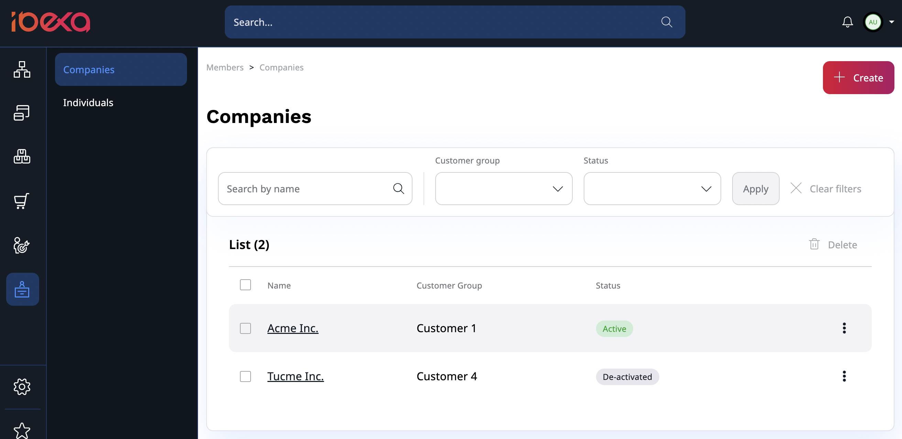
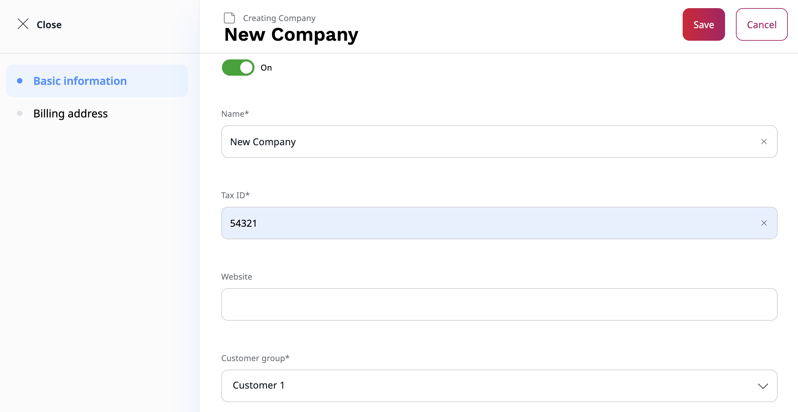

# Customer Portal [[% include 'snippets/commerce_badge.md' %]]

Customer Portal allows you to create and manage business accounts.
With this feature, you can easily manage your organization information,
invite and manage members and view your past orders.

In the Back Office, you can manage multiple organisations or multiple teams within one organisation.

## Create a new company

To create a new company, go to **Members** -> **Companies** section.
There you can view a list of companies you have access to,
you can also edit them or create a new one by selecting **Create** button in the top right corner.

To create a new company, you need to provide:

- name,
- tax ID,
- customer group,
- sales representative.

Optionally, you can add a website and billing address that can speed up a billing process.

## Manage company

## Invite members

List of invitations, copy registration link, re-send the invitation email

## Customer Portal account/dashboard

