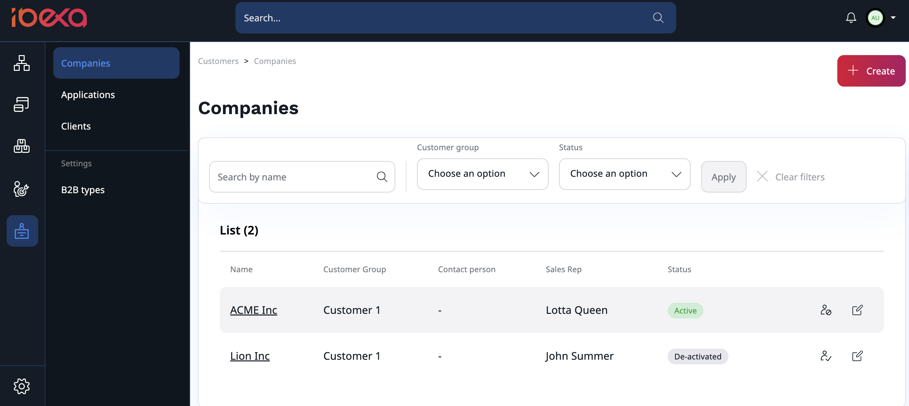
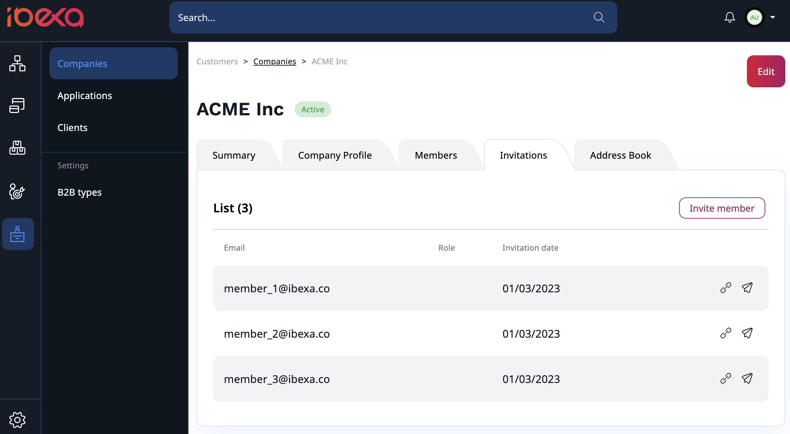
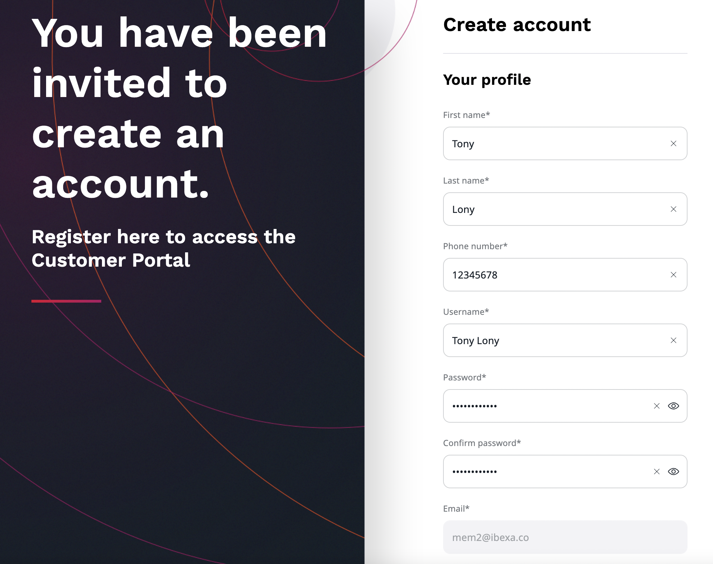

# Customer Portal [[% include 'snippets/commerce_badge.md' %]]

Customer Portal allows you to create and manage business accounts.
With this feature, you can easily manage your organization information,
invite and manage members and view your past orders.

In the Back Office, you can manage multiple organisations or multiple teams within one organisation.

## Create a new company

To create a new company, go to **Members** -> **Companies** section.
There you can view a list of companies you have access to,
you can also edit them or create a new one by selecting **Create** button in the top right corner.

To create a new company, you need to provide:

- name,
- tax ID,
- customer group,
- sales representative.

Optionally, you can add a website and billing address that can speed up a billing process.

## Manage company

Created companies can be managed from the Back Office in the **Members** -> **Companies** section.

Each company has its own profile where you can find:

- summary with basic information and order history
- company profile with billing information and contact person
- list of members and pending invitations
- address book with billing addresses 

## Invite members

There are two places where you can easily invite other members to your organization and manage sent invitations:

- Back Office -> **Members** -> **Companies** -> Select your company -> **Invitations**
- Customer Portal -> **Members** -> **Invitations**

There, you can find a list of all invitations, copy their registration links
and re-send the invitation emails.

To invite new members to your organization, select **Invite members**.

Then, in a pop-up window fill out email addresses one by one,
or use drag and drop to upload a file with an email list.
You also have to assign a role to each new member of your team from a drop-down list.
Click **Send** to send out invitations.

Invited users will receive an email message with a registration link.
With it, they can register and create their account in the Customer Portal.

## Customer Portal Account

