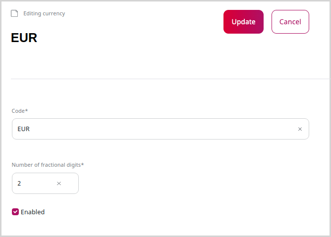

# Manage currencies and shipping costs

Currencies and shipping costs are taken into account when calculating product price.

## Work with currencies

You can configure currencies available in the system in the **Currencies** screen.

The system contains a list of different currencies.
To use them in the catalog, edit and enable them.

To create an additional currency, provide its code (e.g. EUR, USD, GBP) and the number of fractional digits,
that is, the number of digits after the comma/period.

For example, the configuration for the Swiss franc would be `CHF` with two fractional digits.

## Define shipping costs

In the **Shipping management** screen, you can set up shipping cost rules. 
Shipping rules can be managed per delivery country, state, ZIP, and shipping method.

!!! caution

    Shipping costs must be configured in the same currency as the product's base currency (EUR by default).

You can also configure different shipping costs depending on the amount of the basket (including free shipping rules).
