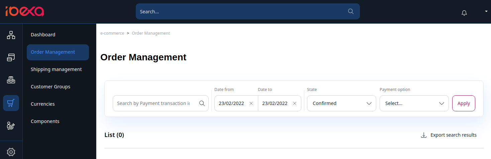
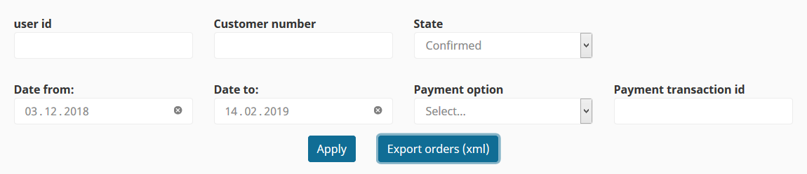
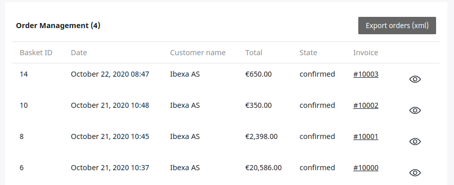
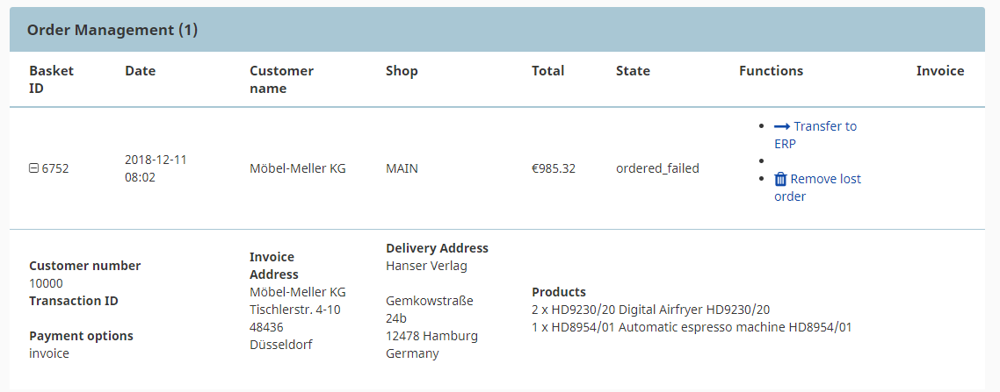

# Manage orders

## Order management

[[= product_name_com =]] provides a list of all orders in **eCommerce** > **Order Management**.

You can check, filter and export all orders that were processed in the shop.
Additionally, you can see the invoice that was automatically generated by the shop for the order (if no ERP is connected).

### Available filters

You can filter orders using the following criteria:

- Date - last month by default.
- State:
    - Confirmed
    - Payed
    - Order failed - the order could not be transferred to the ERP, the shop retries sending it   
    - New - baskets which are not yet sent  
    - Offered - baskets in the payment process
    - Approval - orders using an approval workflow
    - Rejected - orders refused by the approver
- Payment option - the list has to be configured in the section **Configuration settings** under **Checkout**.
- Payment transaction ID.

### Order list

- Basket ID - ID of the basket stored in the database
- Date - date and time this basket was last modified
- Customer name
- Total - total amount from the basket including VAT and shipping costs
- State - state of the basket
- Invoice
- Click on the plus icon to see the following information:  
  - Transaction ID - if the order has been paid using an electronic payment, the transaction code is displayed
  - Payment options
  - Invoice Address
  - Delivery Address
  - Products - list of products (SKU) and the quantity

When an ERP system is used, the orders are transferred to the ERP.
In that case the shop does not create invoices, so no invoice is available in order management,
but you can still check orders in this section. 

### Lost orders

If the ERP system is not running at the moment, [[= product_name_com =]] can store the orders and retransmit them when the ERP is working.
The orders are stored in a database table and marked for retransmission. The shop records the number of retries.
By default the maximum number is 3 (`siso_checkout.default.max_failed_order`).

The shop sends an email to the shop administrator describing details of the order:

Order submission can fail for different reasons, for example because the ERP system is offline, credit limit has been reached, or invalid SKU was provided.

You can view all lost orders by selecting "Order failed" as order state.

#### Re-transfering lost orders

Select the order you want to transfer and click **Transfer to ERP**.
The order is sent to the ERP and after a few seconds you see a message:

