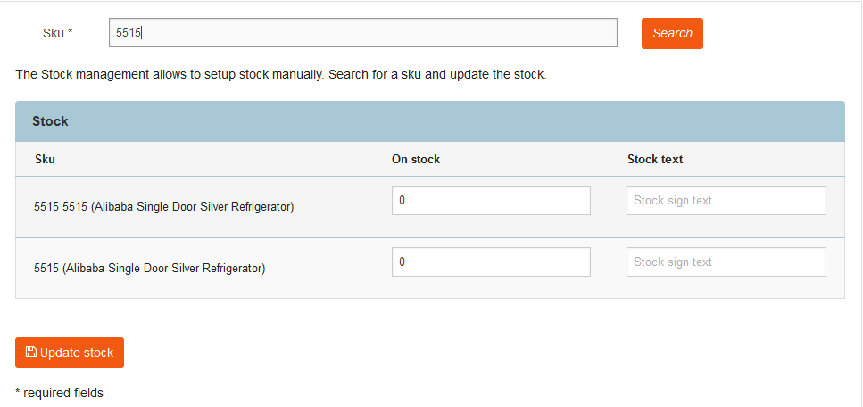

# Manage prices and stock

## Product prices

You can set up product prices if the shop price provider (`siso_price.price_provider.shop`) is configured for calculating prices.

Price management enables you to set up prices manually. A price can be setup per SKU and SKU/variant.
Each price can contain an offer price and a base price.
If an offer price is set, it is displayed in the shop as:

~~Old price: 10.00 €~~ New price: 9.80 €

In addition, prices can vary per customer group.

### Currencies

Currency is configured per country in the [configuration settings](https://doc.ezplatform.com/en/master/guide/configuration/configuration.md#currencies-used-per-country).

If a product has a price for a product and a currency, this price is displayed in the shop.
If no price for a currency is set in a shop, [[= product_name_com =]] offers two possibilities, configured per shop:

- Calculate the price for the requested currency using the base price defined in the product
(using the base currency setup for the installation) and an exchange rate defined in the configuration
- Display an error in the frontend that no price is available

## Stock management

This menu enables you to set up stock if the shop price provider (`siso_price.price_provider.shop`) is configured for calculating prices.

## Importing and exporting prices and stock

You can update stock and prices using a CSV file.
Prices and stock can be downloaded and uploaded if the shop price provider (`siso_price.price_provider.shop`) is configured for calculating prices.

## Shipping costs

In **Shipping cost management** you can set up shipping cost rules. Shipping rules can be managed per delivery country, state, zip and shipping method.

You can also configure different shipping costs depending on the amount of the basket (including free shipping rules).
