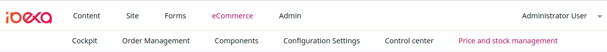
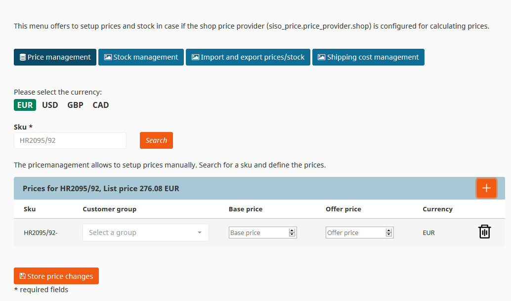
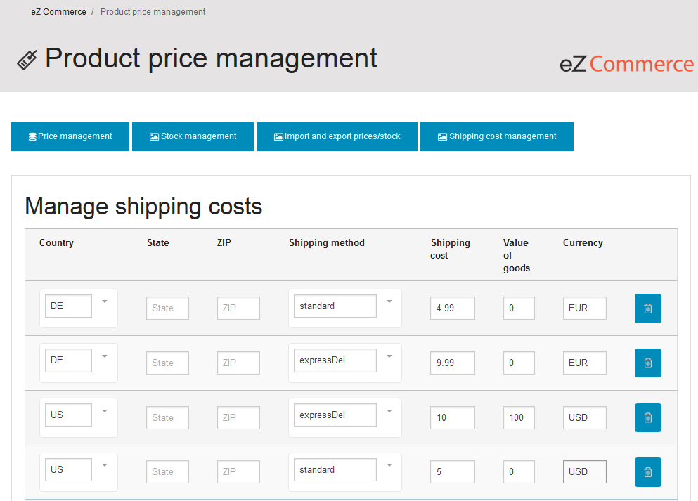

# Manage prices and stock [[% include 'snippets/commerce_badge.md' %]]

## Product prices

Price management enables you to set up prices manually. A price can be set up per SKU and SKU/variant.
Each price can contain an offer price and a base price.

In addition, prices can vary per customer group.

### Currencies

Currency is configured per country in the configuration settings.

If a product has a price defined for a currency, this price is displayed in the shop.
If no price for the currency is set in the shop, there are two possibilities:

- Calculate the price for the requested currency using the base price defined in the product and an exchange rate defined in the configuration
- Display an error in the frontend that no price is available

## Importing and exporting prices and stock

You can update stock and prices using a CSV file.
Prices and stock can be downloaded and uploaded if the shop price provider (`siso_price.price_provider.shop`) is configured for calculating prices.

## Shipping costs

In **Shipping cost management** you can set up shipping cost rules. Shipping rules can be managed per delivery country, state, ZIP, and shipping method.

You can also configure different shipping costs depending on the amount of the basket (including free shipping rules).
