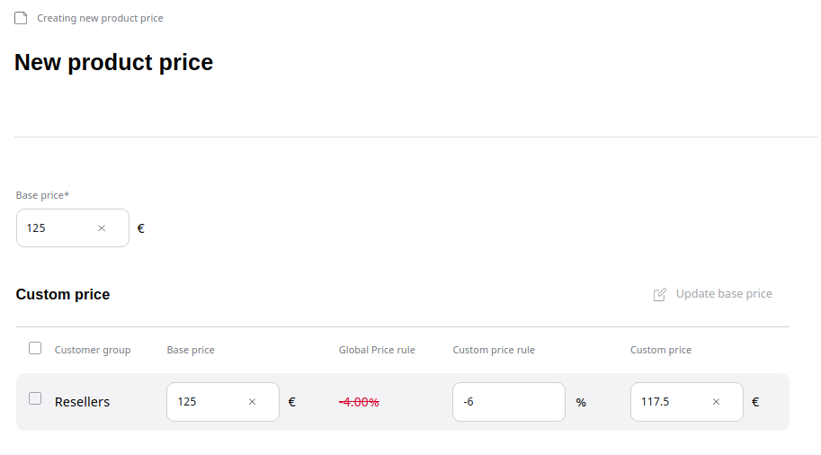

# Manage prices and stock

## Product prices

Price management enables you to set up product prices manually. 
A price can be set up per product and product variant.

In addition, prices can vary per customer group.

!!! note

    To set up product prices, your system must have at least one currency enabled.

To set a price, navigate to the product's **Prices** tab.
Here you can see the existing prices for the selected currency.

Select a currency in the dropdown menu to preview the price and click the edit button to modify it.

For each product you can set prices separately for different customer groups.
Next to the base price you can see the **Global Price rule** defined for this customer group,
which is applied to the base price.
However, you can also set a **Custom price rule** for this product.
If you define it, the Global Price rules does not apply and the custom price rule is applied directly to the base price.

You can preview the resulting price for this product and the given customer group in the **Custom price** field.

## Currency

You can configure currencies available in the system in the **Currencies** screen.

The system contains a list of different currencies.
To use them in the catalog, edit and enable them.

To create an additional currency, provide its code (e.g. EUR, USD, GBP) and the number of fractional digits,
that is, the number of digits after the comma/period.

For example, the configuration for the Swiss franc would be `CHF` with two fractional digits.

## Shipping costs

In the **Shipping management** screen, you can set up shipping cost rules. 
Shipping rules can be managed per delivery country, state, ZIP, and shipping method.

!!! caution

    Shipping costs must be configured in the same currency as the product's base currency (EUR by default).

You can also configure different shipping costs depending on the amount of the basket (including free shipping rules).
