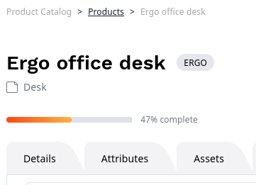

# Products

The product catalog enables handling of products offered in the website,
including their specifications, and pricing.

The catalog is available in the left menu.

## Create products

To create a product you must first decide which product type it belongs to.

Product types represent categories that a product can belong to.
A product type can be, for example, a sofa or a keyboard.

Product types, like Content Types, define the global properties of products and Fields a product consists of.
A product type also defines the attributes that all products of this type can have.

To create a product type:

1\. Go to **Product catalog** -> **Product Types** and click **Create**.

2\. Fill in basic product information: name, identifier and description.

Each product has a product code that must be unique. It identifies the product in the system.
Product code can have up to 64 characters. It can contain only letters, numbers, underscores, and dashes.

3\. If needed, add additional Fields decriptinb the product.

4\. Add attributes.

## Attributes

Attributes describe a product's characteristics.
The customer can use them to filter and search for products.

Typical product attribute examples are: length, weight, color, format, and so on.

Attribute types define what type of information you can store in an attribute.
Available attribute types are:

- Checkbox
- Color - presented as a hex value
- Float - represents a number with fractions
- Integer - represents a number without fractions
- Measurement (range) - measurement with a given unit and minimum/maximum values selectable per product type
- Measurement (single) - measurement with a single value in given unit
- Selection - one of a list of customizable options

Each attribute belongs to an attribute group.
An example of an attribute group can be dimensions (which consists of length, width, height, and so on).

When adding attributes to product types, you can add both individual attributes, and whole groups.
You can also remove attributes from groups that you do not want to use for the given product type.

### Attributes and variants

Product attributes are the basis for creating variants.

For every attribute, you can select **Used for product variants**.
Attributes that have this option are used to [automatically generate product variants](product_variants_and_assets.md#generating-variants).

## Product availability and stock

To control a product's availability and the available stock, in product or variant view go to **Availability** tab.
If a product can have variants, you must set availability for each variant separately.

Click **Create** to add availability to a product that doesn't have it, or **Edit** to modify existing availability settings.

Use the **Available** switcher to indicate whether the product is currently available in the catalog.

You can also set the exact number of products available in stock.
Set the availability to **Infinite** if specific stock number is not tracked.
You can use it, for example, for digital download products.

## Product completeness

When you create and edit products, under the product name you can see visual indication
of what part of product information (tasks) you have completed, and what part is still missing.

You can view full information about completed tasks in the product view's **Completeness** tab.

This tab lists all tasks required for product configuration, including:

- content (such as images and descriptions)
- attributes
- assets
- availability
- prices in different currencies
- translations

You can click the edit button next to an unfinished task in the Completeness table
to move directly to the screen where you can add the missing information.
