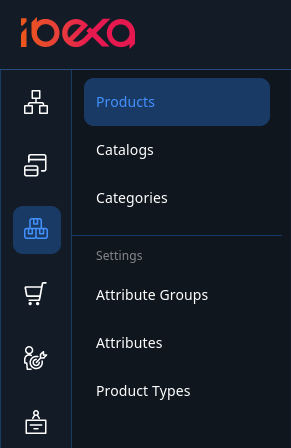
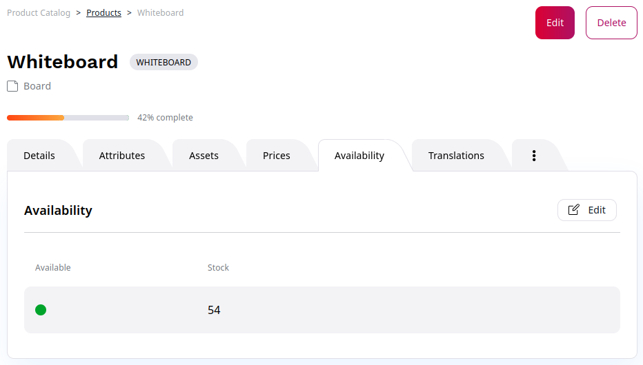
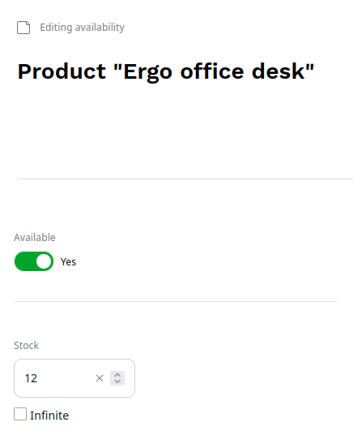

# Products

The product catalog enables handling of products offered in the website,
including their specifications, and pricing.

The catalog is available in the left menu.

## Create products

To create a product you must first decide which product type it belongs to.

Product types represent categories that a product can belong to.
A product type can be, for example, a sofa or a keyboard.

Product types, like Content Types, define the global properties of products and Fields a product consists of.
A product type also defines the attributes that all products of this type can have.

## Attributes

Attributes describe a product's characteristics.
The customer can use them to filter and search for products.

Typical product attribute examples are: length, weight, color, format, and so on.

Each attribute belongs to an attribute group.
An example of an attribute group can be dimensions (which consists of length, width, height, and so on).

When adding attributes to product types, you can add both individual attributes, and whole groups.

### Attributes and variants

Product attributes are the basis for creating variants.

For every attribute, you can select **Used for product variants**.
Such attributes are used to [automatically generate product variants](product_variants_and_assets.md#generating-variants).

## Product availability and stock

To control a product's availability and the available stock, use the product's or product variant's **Availability** tab.

If a product can have variants, you must set availability for each variant separately.
If it cannot have variants, you can set availability for the whole product.

Use the switcher to indicate whether the product is currently available in the catalog.

You can also set the exact number of products available in stock.
Set the availability to **Infinite** if specific stock number is not tracked.
You can use it, for example, for digital download products.

