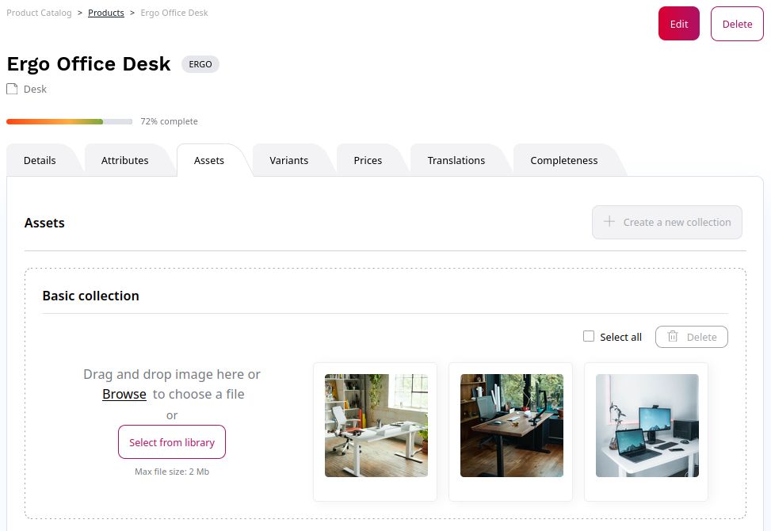

# Manage products and categories

## Managing categories

When you use the Repository data provider, the product catalog is fully integrated into the content tree. 
The products are managed as Content items.

Products and categories can be assigned to the product catalog.

## Product variants

[[= product_name =]] offers one or two level variants. 
A variant can be added directly in the product view.

There are three preconfigured variant types: Color, Size, and Color and Size.

The list of variant types can be extended in the configuration.

## Product assets

Assets, such as images or videos, can be added per product (not per variant).
By default a product can have one main image and up to three additional images,
one PDF, and one link to a video (e.g. YouTube).

## Product stock
	
The stock can be managed by SKU and SKU/variant. This can be done manually or per upload.

In addition, you can add a text about stock availability (e.g. informing that a product is out of stock but will be back on a given date).
After an order is placed, the stock is reduced by the number of products bought by the customer.

You can manage stock in two places:

1\. In the product in the **eCommerce** tab:

2\. In the **eCommerce** section under [**Price and stock management**](manage_prices_and_stock.md).
