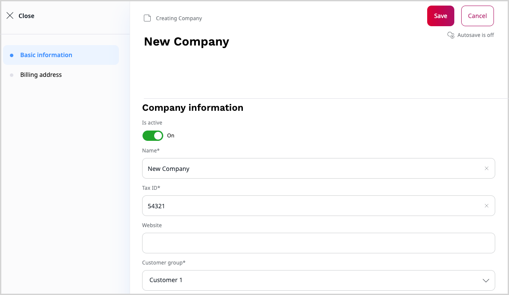
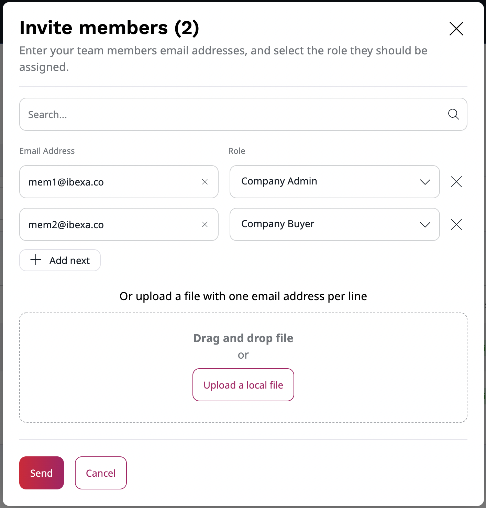

# Customer management [[% include 'snippets/experience_badge.md' %]]

In the Back Office, you can manage members of your team,
customers and organizations' accounts in your system, including their shop activities such as orders.

## Create a new company

To create a new company, go to **Members** -> **Companies** section.
There you can view a list of companies you have access to,
you can also edit them or create a new one by selecting **Create** button in the top right corner.

To create a new company, you need to provide:

- name
- tax ID
- customer group
- sales representative

Optionally, you can add a website and billing address that can speed up a billing process.

## Manage company

Created companies can be managed from the Back Office in the **Members** -> **Companies** section.
Each company has its own profile where you can find:

- summary with basic information and order history
- company profile with billing information and contact person
- list of members and pending invitations
- address book with billing addresses

From there, you can edit the company information, invite members, manage their roles and edit their basic information.
You can also add members to a team from existing pull of users.
Note that the Contact Person in the company has to be a member of that company.

### Admin Panel

You can also manage companies from **Admin**.
There, in the **Corporate** section, you can find a list of members,
billing addresses and technical details regarding the organization such as visibility, IDs, relations and so on.

In the **Roles** section, you can define Policies for each User Group, for example, a Company buyer.
You can also set up Policies for every user that is using business account by editing a **Corporate Access** role.
If you decide to remove any Policies from the **Corporate Access** role, the feature may not work properly.

## Invite members

To invite other members to the organization,
go to **Members** -> **Companies** -> Select your company -> **Invitations**.

There, you can find a list of all invitations, copy their registration links
and re-send the invitation emails.

To invite new members to the company, select **Invite member**.

Then, in a pop-up window fill out email addresses one by one,
or use a drag and drop to upload a file with an email list.
You also have to assign a role to each new member from a drop-down list.
Click **Send** to send out invitations.

Invited users will receive an email message with a registration link.
With it, they can register and create their account in [the Customer Portal](customer_portal.md).

