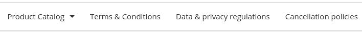
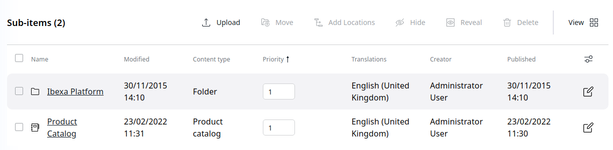

# Navigation structure

Click **Content** > **Content structure** to access the objects displayed in the top navigation

The following Content Types are supported:

- Article
- Folder
- Landing page

The main menu of the site displays elements only if the Priority is higher than 0.
Elements with lower Priority are displayed first.
