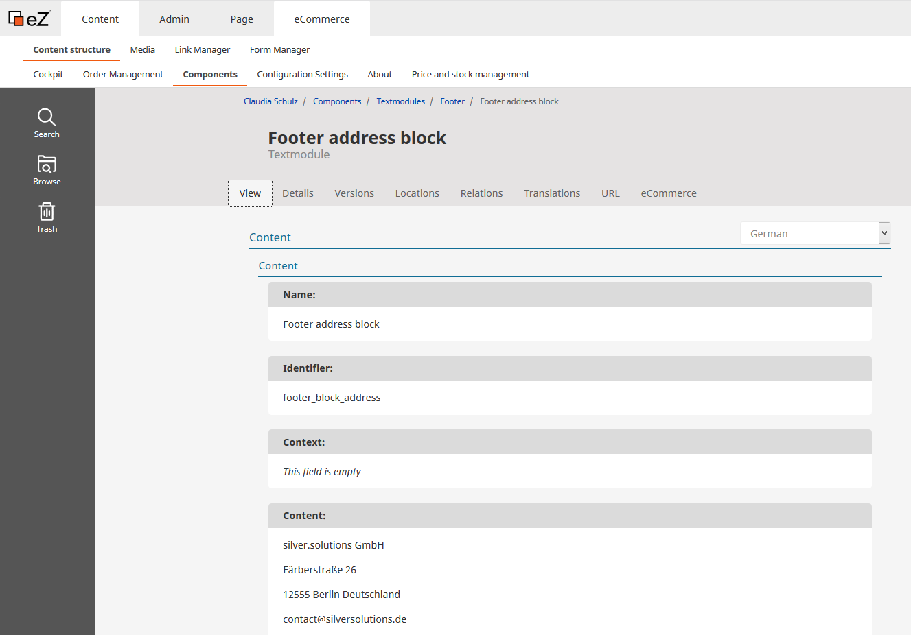
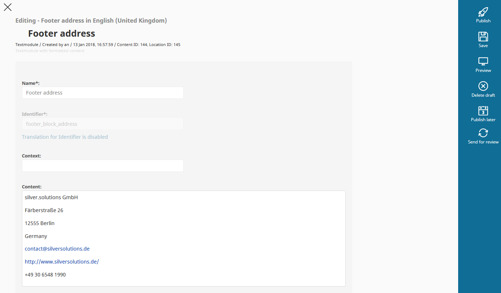
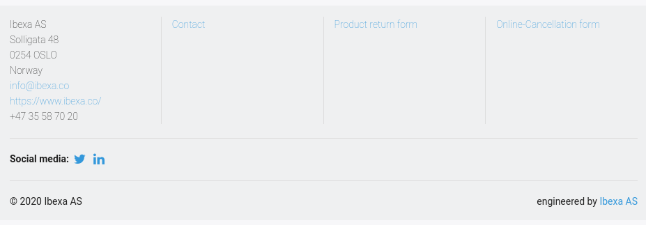

# Translations

## Text modules

Text module is a special Content item in eZ Commerce.
It enables the shop owner or editor to translate some of the text information in the shop using the Online Editor.

Text modules are used for some short explanatory texts in the shop.
Every text module has a unique identifier.

This identifier must match exactly and cannot be changed even with text changes.
If a text module has not yet been translated, the identifier is displayed in the frontend.

### Example

To create a text for the site footer, go to the **Components** section,
to **Textmodules** > **Footer** and choose "Footer block address".

Edit this Content item and select the correct language, introduce your changes and publish the content.

You can see the result when you reload the page.

### Caching

Text modules are cached. You can [refresh the text modules](https://doc.ibexa.co/en/master/guide/cache/content_cache_refresh/content_cache_refresh) when they are edited.
Workflows and cron job have to be configured for that.

However, if the full page is cached in HTTP cache, the new translation for the text module appears after the HTTP cache expires or is removed.

## Working with OneSky

[OneSky](https://www.oneskyapp.com/) is an external platform for managing translations. You can use this platform to offer a user interface for translations management.

See [OneSky in the guide](https://doc.ibexa.co/en/master/guide/translations/onesky.md) to learn how to set up OneSky for your shop.
