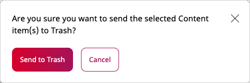
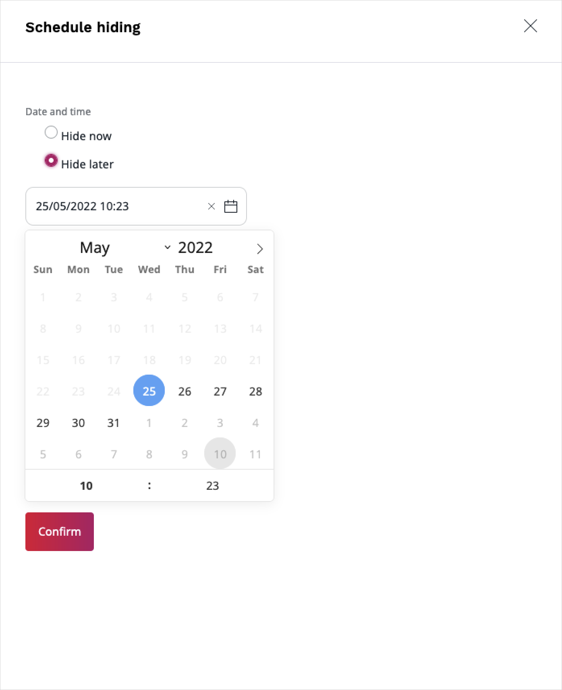
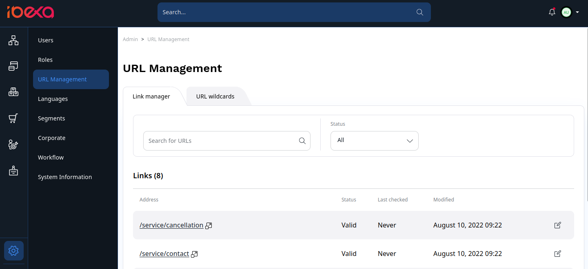
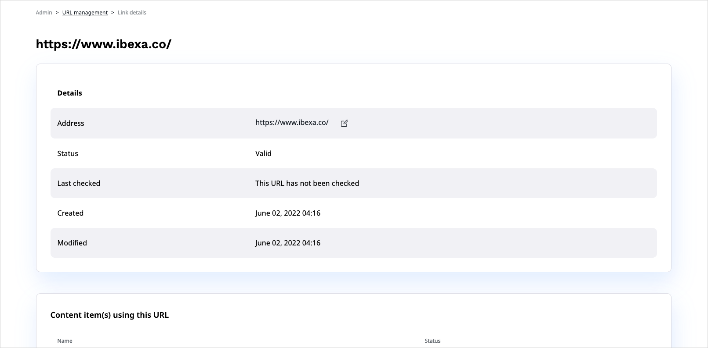
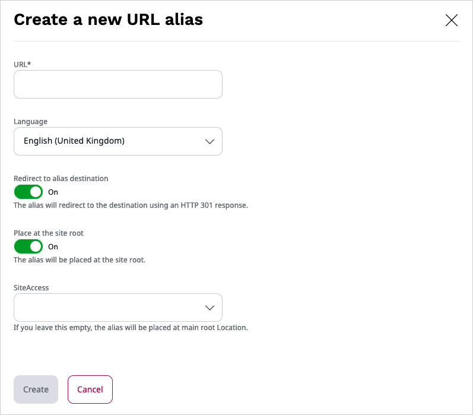
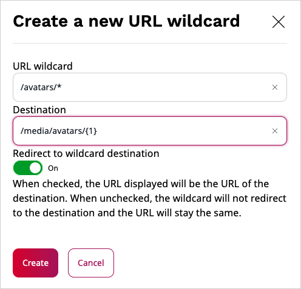
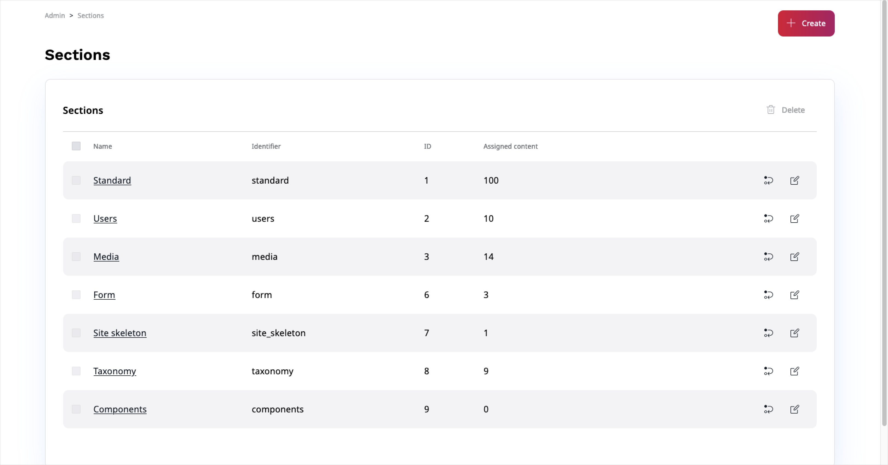
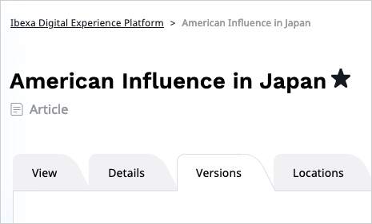
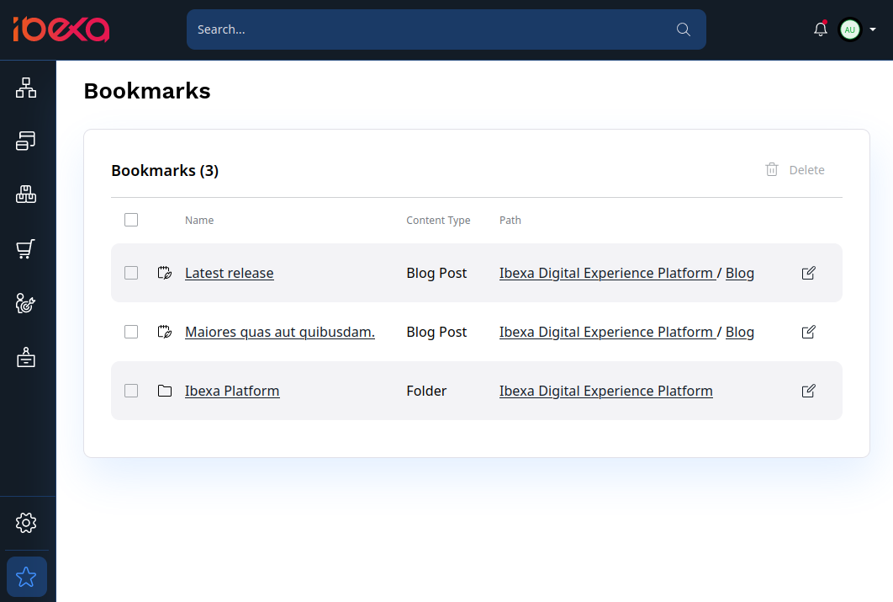
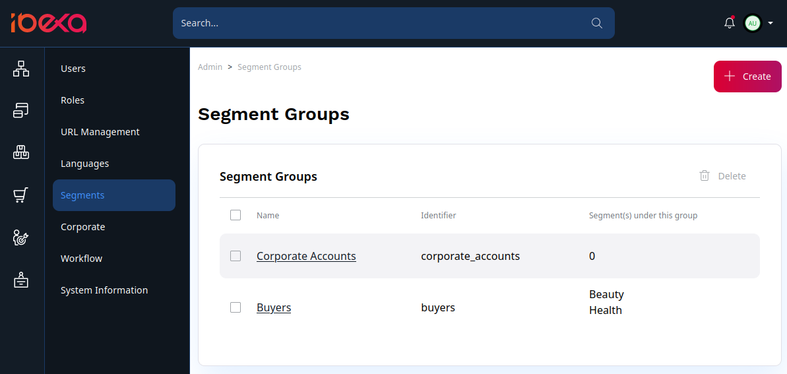

# Organizing the content

## Content Locations

A Content item by itself does not have a place in the Content tree and is not visible for a visitor of the website.
To be available on the website, it has to be assigned a Location ID.
A new Content item is automatically assigned a Location when you publish it.

A Content item can have more than one Location ID. In such a case you can find it in more than one place in the Content tree.
A single Location can only have one Content item in it.

!!! tip "Example"

    You can use multiple Locations for an Article about a local sports team's victory,
    which you can place in the tree both under Local News and Sports News.

Even if a Content item is placed in more than one Location, one of the Locations is always treated as the main one.

To assign other Locations to content, view this Content item's **Location** tab and click the plus button.
Then select the new parent from the Content Browser.

### Hiding Locations

You can manage the availability of content by hiding or revealing it.
You can do this in the Content item's Locations tab by using the Visibility switcher.
Notice that this way only affects a *Location*, not the *Content item*.
Even if you hide the content in one Location, it remains visible in its other Locations.
You can also [hide a whole Content item](#hiding-content).

When a Location is hidden, all of its children (other Content items that are under it in the tree) will also be automatically hidden.
They can only be revealed if the parent Location is revealed as well.

A hidden Location will be invisible for everyone viewing the website.
If you are looking for a way to allow only some users to view parts of the Content tree,
use [Sections](#sections) and combine them with [proper permissions](organizing_the_site.md#permissions).

### Swapping Locations

You can swap two Content items in their Locations by going to the **Swap Locations** section
in the **Location** tab and selecting a Content item to swap with.

!!! caution

    Swapping Locations republishes their respective URL aliases.
    This means that if the swapped Content item was accessible by the URL that had a number at the end
    (added due to a name conflict), then after the swap the number will be removed (if possible).
    The opposite case also applies.

    Swapping Locations for Content item with the same name and parent results in swapping their URL aliases.
    This means that if the Content item was previously accessible by a URL without a number at the end,
    after the swap it will be accessible by a URL with a number at the end (and the other way around).

    If at some point there were more than two Content items with the same name under the same parent, then result of swapping such Content items might not be obvious. The general rule is that the Content item that previously had a higher number at the end of its URL alias will have its URL alias republished first, resulting in the lowest nonconflicting number (or the lack of) at the end of its URL alias. The Content item that previously had a lower number at the end of its URL alias will have its URL alias republished second, resulting in the second lowest nonconflicting number at the end of its URL alias.

## Managing content

### Moving and copying

You can move or copy existing Content items by choosing the proper option from the menu on the right.
You can also copy the whole subtree (a Content item with all content under it in the structure).

!!! note

    Copying very large subtrees may take too much time and server effort. That is why the system administrator
    may set a limit on how many Content items can be copied at the same time.

    See [Copy subtree limit]([[= developer_doc =]]/guide/config_back_office/#copy-subtree-limit)
    in the developer documentation on how to set this up.

Copying creates a new Content item.
If you only want to have the same Content item to another place in the Content tree, add another Location to it.

### Removing content

You can remove content by clicking **Send to Trash** in the menu.
If you remove a Content item that has children (other content under it in the content tree),
both this item and the children will be removed. This also breaks the connection between the items,
so you will not be able to restore them with the same structure.

Notice that the Content item is not removed completely.
It is moved to Trash, which you can access from the left menu.
In the Trash, you can search for Content items and sort your search results based on different criteria. You can then select removed Content items and restore them to their original Locations or to new Locations you choose.
If the Content item's parent has been removed, you need to select a new parent Location.

If a Content item has more than one Location, selecting **Send to Trash** will remove the Content item only from the current Location.
The content will appear in Trash only once you have removed the last Location.

You can permanently remove a Content item by checking it and clicking the trash icon.
You can also permanently remove all content from the Trash by clicking **Empty Trash**.

!!! caution "Warning"

    Emptying the Trash cannot be undone!

### Hiding content

You can hide a Content item by clicking **Hide** in the menu.

When you click **Hide**, you can choose to **Hide later**
and select and date and time when the Content item will be hidden:

A hidden Content item is unavailable for anyone on the front page. It is also grayed out in the Content Tree.

This is different from [hiding Locations](#hiding-locations), because it affects the Content item
in all of its Locations.

## URL management

In your site, you can manage external URL addresses and URL wildcards.
You do this in the Back Office, **Admin** tab, the **URL Management** node.

For more information about URL management, see the [Ibexa Developer Documentation.]([[= developer_doc =]]/guide/url_management).

### Link manager

In your site you can link to external websites by placing links inside rich text, or by using the URL Field.
You can view and update all external links that exist within the site, without having to modify and re-publish the individual Content items.

The Link manager tab shows a list of all links in the site. Click any item in the list to see its details and a list of Content items that use this URL.

You can change any link in the Link manager. It is then updated in every place where it is used, across all Content items.

The Link manager list also shows whether the link is alive or dead in the **Status** column. The **Last checked** column displays when the status was last verified.

!!! note

    When you edit a link in the Link manager, you cannot change the URL address to one that already exists in the system.

    Once you save the link, it is automatically be marked as "Valid".

### URL aliases

Each Content item can have one or more URL aliases. They are additional URLs that can be used to access this Content item.

You can add URL aliases in the URL tab under **Custom URL aliases for <Content name>** by clicking the plus button.
The URL alias must be unique for the whole installation, regardless of the language.

For each new alias, you can set the following options:

- Language - the language of the Content item that the alias redirects to.
- Redirect to alias destination - when toggled on, the alias will redirect to the Content item's actual URL.
- Place at the site root - when toggled, the alias will be created in the root of the site.
If this is toggled off, the alias will be relative to the parent of the Content item.
- SiteAccess - when selected, the prefix of the respective SiteAccess is added to the alias path.

### URL wildcards

With wildcards, you can replace a portion of the URL address for many Content items at the same time, for example, to shorten the path, or to make the path meaningful for the readers.

The URL wildcards tab shows a list of all URL wildcard definitions that exist within the site, and contains all the information about each URL wildcard. You can delete or modify existing entries, or create new ones.

For each URL wildcard definition, you set the wildcard pattern and the destination. Also, you decide whether the link should redirect users to the destination's original address.

## Sections

You can divide your Content tree into Sections to better organize it.
Sections let you decide which Users will have access to which parts of the tree.
To see which Section a Content item belongs to, look at its **Details** tabs.

You can set up Sections in **Admin**, in the **Sections** tab.
A few Sections are provided with each installation, and you can add new ones.

In the **Sections** tab, you can assign Sections to content or delete them.
You can only delete Sections that do not contain any content.

Each Content item must belong to a Section. By default, new content is placed in the same Section as its parent.
If you want to remove a Content item from a Section, you just need to assign it to a different one.

Access to Sections can be restricted by [setting up proper permissions](organizing_the_site.md#permissions).

## Object states

You can assign specific Object states to all Content items in your site.
You can do it when viewing the Content item, in the **Details** tab, in the **Object state details** section.

!!! note

    The functioning of Object states can be set up differently in each installation.
    Contact your site administrator for information on how to use the states in your case.

## Bookmarks

You can bookmark any Content item by clicking the star icon next to the Content name.

Bookmarks are stored per user. You can view a list of all bookmarks by clicking Bookmarks in the left menu.

## Segments [[% include 'snippets/experience_badge.md' %]] [[% include 'snippets/commerce_badge.md' %]]

With segments you can target content at specific groups of your users.
You can use them to display different content to different Page visitors by using the [Targeting block](working_with_page.md#targeting-block).

You can create and configure Segments and Segment Groups in the **Admin** section of the Back Office.

!!! note

    Assigning Users to Segments happens automatically according to rules set up by the administrator.
    Contact your site administrator for more information about your setup.
