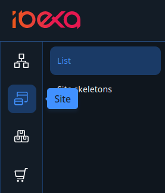
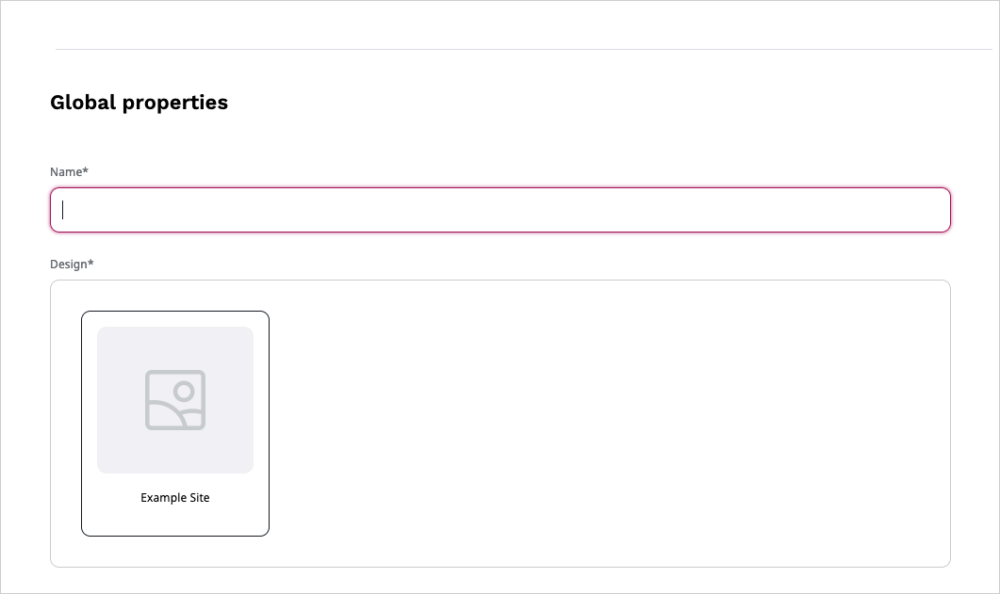
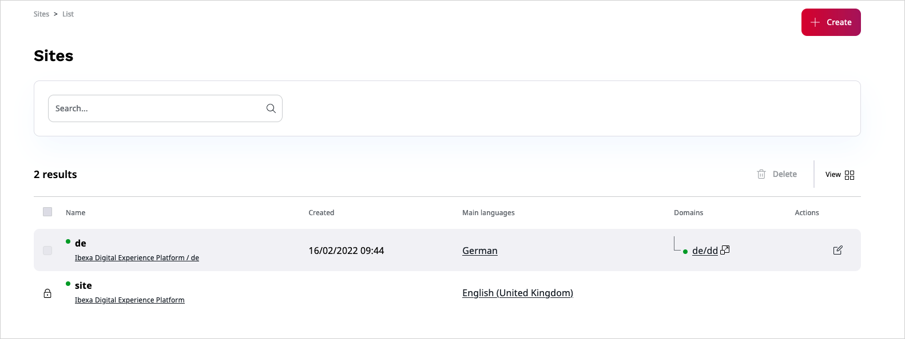

# Site Factory

The Site Factory allows you to easily create and manage multiple sites in different languages from one place.
All the sites can be kept in one repository and have the same instance.
To be able to use it, the Site Factory has to be enabled and configured by your administrator.
For more information see developer documentation on [Site Factory]().

## Create a site

To access Site Factory select **Site** tab and Site Factory icon.
If Site Factory is enabled, and you have sufficient permissions you should be able to click **Create** button and access **Creating a new Site**.

Here, you can create an entirely new site or a different language version of an already existing site.
First, you will select a name and predefined design for your site.

Next, you can decide if the site will go live after creation or will be offline by switching status bar.
In this section you will also define the access URL address(es) and main language, as well as fallback languages of the site.

If all required fields are filled out you can select **Create,** and the site will be added to the site list in the **Site** tab.

## Edit a site

To edit the site select **Site settings** icon that is situated next to the site name.
Here, you can edit all the elements you selected during creation of the site:

- name
- design
- visibility
- URL
- language

## Delete a site

To enable deleting a site you have to change the site status to offline.
Live sites cannot be deleted. Next, select **delete** icon and confirm your choice.

