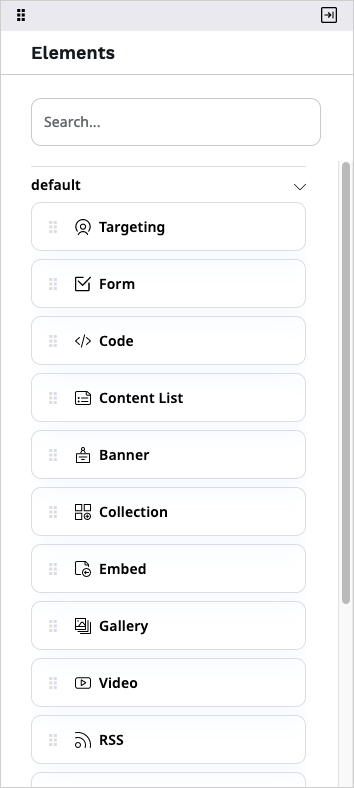
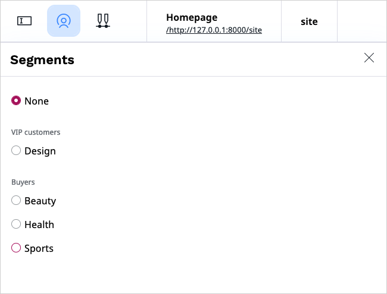
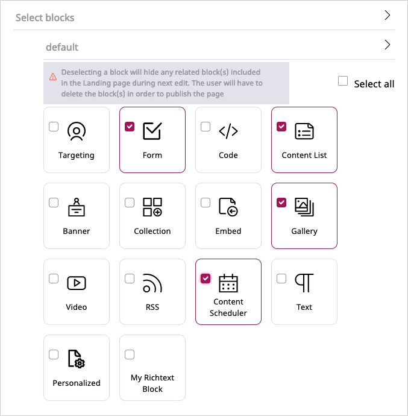
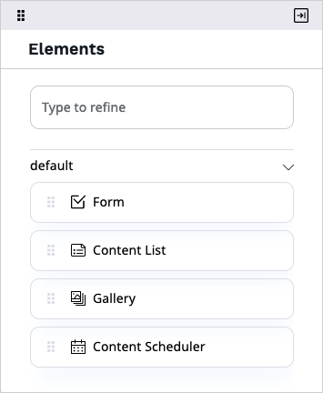
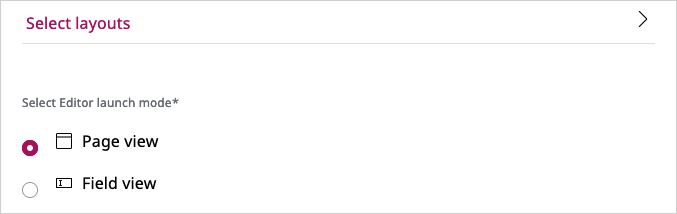
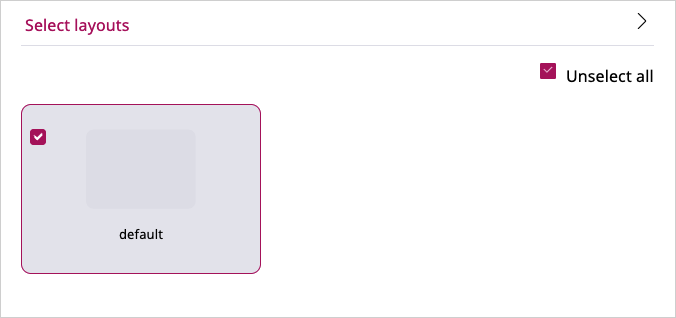

# Pages [[% include 'snippets/experience_badge.md' %]] [[% include 'snippets/commerce_badge.md' %]]

**Page** is a special Content Type that contains zones onto which you can drop 
different dynamic blocks.
You can edit it to personalize the layout and contents of your website.

!!! tip
    The Page Content Type contains a **Landing Page** Field Type which manages 
    the zones and blocks.
    Any Content item that has the **Landing Page** Field Type will behave like 
    the Page Content Type.

## Creating Pages

To create a new Page, in the upper toolbar click **Content** and from the list below select **Content structure**.
On the right-side toolbar, click **Create** and from the list of Content items select **Landing page**.
On the **Page creation** modal, select the layout and click **Create draft**.

You can also add a new Page in the Page Builder.
Open the Page Builder by clicking **Site** and selecting a site from the list that 
appears next to the **List** icon.
On the [Page Builder toolbar](#page-builder-toolbar) click the plus button and from the list select **Landing page**.
On the **Page creation** modal, select the layout and click **Create draft**.

Before publishing or saving the Page, edit its title and description.
Switch to the Field view using the [Page Builder toolbar](#page-builder-toolbar).

!!! note "Autosave"

    To help you preserve your work, [[= product_name =]] saves drafts of Content items automatically.
    For more information, see [Autosave](../publishing/publishing.md#autosave).

## Editing Pages

You edit Pages using the Page Builder.
To start editing an existing Page, in the Back Office click **Page** and select the page from the list that appears below.

## Page Builder toolbar

The Page Builder comes with a toolbar that enables you to perform advanced editing and previewing of the Page.

Using the toolbar buttons, you can perform the following actions:

|Button|Description|
|------|-----------|
||Switch between previewing and editing the Page.|
||Access preview of the Page for a given Segment.|
||Toggle through to see how the Page is rendered on different devices.|
||Access the timeline to preview how the Page changes with time. You can also view the list of all upcoming scheduled events. For details, see [Timeline](../publishing/advanced_publishing_options.md#timeline).|
||Access menu enabling you to switch layout, see versions of the Page, manage translations, or delete the Page.|
||Access menu with Elements.|

In a newly created Page you can [choose a layout](#configure-available-page-layouts) which defines the available zones.

Applying a layout divides the Page into the defined zones. The zones are placeholders for Content items.
Now you are ready to add blocks of content to the Page.

## Adding blocks

In Page Builder you can access a menu of **Elements** — a set of blocks of content that you can add to the zones of the Page.
Each block is unique in its function and enables you to customize the content appearing on the Page.

Add a block by dragging it from the menu to an empty place on a zone.
Do not worry about placing blocks in the proper place from the start.
You can reorder them at any time by dragging and dropping them in the desired location.

[[= product_name_ee =]] comes with a set of ready-to-use Page blocks,
but [developers can add their own](https://doc.ibexa.co/en/latest/guide/page/create_custom_page_block/).

The blocks provided with a clean installation of [[= product_name_ee =]] are:

|Block|Description|
|-----|-----------|
|Targeting|Embeds a Content item depending on the [Segment](organizing_the_content.md#segments) the user belongs to. For details, see [Targeting block](#targeting-block).|
|Form|Embeds a Form Content item that you select from the Content Structure. For details, see [Form block](#form-block).|
|Code|Enables you to place text, links, images, etc. on your Page using custom HTML. For details, see [Code block](#code-block).|
|Content List|Displays Content items of a chosen Content Type (or Types) that are contained in a selected folder. For details, see [Content List block](#content-list-block).|
|Banner|Displays an image Content item with a URL attached to it. For details, see [Banner block](#banner-block).|
|Collection|Displays a set of Content items you select manually from the Content structure. For details, see [Collection block](#collection-block).|
|Embed|Embeds a Content item of any Content Type on the Page. For details, see [Embed block](#embed-block).|
|Gallery|Displays all images contained in a selected folder. For details, see [Gallery block](#gallery-block).|
|Video|Embeds a video into the Page with standard playback controls. For details, see [Video block](#video-block).|
|RSS|Loads and displays news from RSS feeds (channels). For details, see [RSS block](#rss-block).|
|Content Scheduler|Displays Content items at a pre-defined time. For details, see [Content Scheduler block](../publishing/advanced_publishing_options.md#content-scheduler-block).|
|Text|Enables you to add to the Page a Rich Text block. For details, see [Text block](#text-block).|

## Block settings

Each kind of block has its special properties.
You can access them by placing the cursor on the added block and clicking the 
**Block settings** (cog) icon.
Use the same menu to remove the block from the Page by clicking the **Delete** (trash) icon.

Settings available for blocks are divided into three tabs — **Basic**, **Design**, and **Scheduler**.
The settings available on the **Basic** tab are tailored to the block's content.

The remaining tabs contain parameters common to all blocks provided with [[= product_name =]].
Use them to modify the layout and visibility of a block. For details, see [Scheduling publication](../publishing/advanced_publishing_options.md).

You cannot publish a Page if you have not set all the required settings of all blocks.

!!! tip
    Settings and function of custom-made blocks of content depend on their design.
    For details on adjusting and using them, contact your website administrator.

After you change the block settings, click **Submit** to save the changes or **Discard** to cancel.

### Targeting block

On the **Basic** tab, perform the following actions:

- In the **Name** box, provide the name of the block.
- In the **Select default content** section, click **Select content**, navigate through the content
and select the default Content item that will be displayed when no priority rules are valid.
- In the **Setup segment and content matching priority rules** section, select a Segment Group and a Segment,
then click **Select content** and navigate to the Content item that you want to display for the selected group.

The rules are checked in order, so if a user belongs to more than one Segment, the first rule applies.

You can preview the page for each of the available Segments:

### Form block

Note that completing the settings of the Form block requires at least one Form Content item created.

On the **Basic** tab, perform the following actions:

- In the **Name** box, provide the name of the block that will appear on the Page.
- In the Form section, click **Select content**, navigate through the content and select a Form Content item to append it to the block.

### Code block

On the **Basic** tab, perform the following actions:

- In the **Name** box, provide the name of the block that will appear on the Page.
- In the **Content** box, enter the HTML code for the content you want to display on the Page.

### Content List block

On the **Basic** tab, perform the following actions:

- In the **Name** box, provide the name of the block that will appear on the Page.
- In the **Parent** section, click **Select content**, navigate through the content and select a folder containing Content items
to display on the list. Click **Confirm**.
- In the **Limit** section, enter a number or use the up and down buttons to set the limit of Content items to display.
- From the **Content Types to be displayed** list, select Content Type(s) to be displayed.
The block will display Content items of the selected Content Types that are in the selected parent folder.

### Banner block

On the **Basic** tab, perform the following actions:

- In the **Name** box, provide the name of the block that will appear on the Page.
- In the **Image** section, click **Select content**, navigate through the content and select an image to display.
- In the **URL** box, enter a URL to open when clicking the selected image.

### Collection block

On the **Basic** tab, perform the following actions:

- In the **Name** box, provide the name of the block that will appear on the Page.
- In the **Location list** section, click **Select content**, navigate through the content
and add to the collection Content items of any Content Type you want.
All selected Content items appear in the **Selected items** box at the bottom of the window.
When done selecting, click **Confirm**.

### Embed block

On the **Basic** tab, perform the following actions:

- In the **Name** box, provide the name of the block that will appear on the Page.
- Select content to embed by clicking **Select content**. Navigate to a Content item, select it and click **Confirm**.

### Gallery block

On the **Basic** tab, perform the following actions:

- In the **Name** box, provide the name of the block that will appear on the Page.
- In the **Folder** section, click **Select content**, navigate through the content, select a folder containing images to display and click **Confirm**.
After submitting the settings, all images in the folder will appear in the Gallery block.
Note that selecting a folder containing Content items other than images results in displaying only a link to the folder they are stored in.

### Video block

On the **Basic** tab, perform the following actions:

- In the **Name** box, provide the name of the block that will appear on the Page.
- In the **Video** section, click **Select content**, navigate through the content, select a video to display in the block and click **Confirm**.
On the **Basic** tab you can preview the selected video before adding it to the Page.

### RSS block

On the **Basic** tab, perform the following actions:

- In the **Name** box, provide the name of the block that will appear on the Page.
- In the **URL** box, provide the URL for the RSS news feed.
- In the **Limit** box, enter a number or use the up and down buttons to set the limit of news items appearing in the block.
- In the **Offset** box, enter a number or use the up and down buttons to set the limit of featured news items appearing in the block.

### Text block

On the **Basic** tab, perform the following actions:

- In the **Name** box, provide the name of the block that will appear on the Page.
- In the **Content** box, enter text, images, videos, etc. using the Online Editor.
For details, see [Editing Rich Text Fields](../creating_content_basic.md#editing-rich-text-fields).

### Personalized block

On the **Basic** tab, set values in the following fields:

-	**Block name** – Optionally, enter a name for the page block, for example, "Bestsellers".
-	**Select a scenario** – Select "Landing page" or "Top clicked".
-	**Select a Content Type...** – Select "Product".
-	**Display limit** – Set the number of products to be displayed, for example, 4.

On the **Design** tab, in the **View** field, change the layout to "Products" and submit your changes.

## Configure block display

As an administrator, you can define which page blocks elements are available for an editor in the page edit mode.

Go to the Content Type that you want to edit. 
In the **Field definitions** section, click the **Landing page** tab.
Expand the **Select blocks** section, and select page blocks.

To apply changes, click **Save**.

Now, only selected page blocks are available in the edit mode.

!!! caution
    When you deselect blocks, any related blocks that are included in the Landing page hide as well. 
    To publish the Page,
    a user has to delete these blocks from the Landing Page.

!!! caution "Add new blocks"
    If a [developer creates a new block](https://doc.ibexa.co/en/latest/guide/page/create_custom_page_block/) and you want to make it available 
    in the editor mode, you must select it manually in the **Select page blocks** section.

## Configure preferred edit mode

As an administrator, you can set the edit mode that is launched when an editor starts editing the Page.

Go to the Content Type that you want to edit. 
In the **Field definitions** section, click the **Landing page** tab.
Expand the **Select Editor launch mode** section, and select from the available options.

## Configure available page layouts

As an administrator, you can configure which page layouts are available for an editor.
On the **Admin** tab, click **Content Types**.
Go to the Content Type that you want to edit. 
In the **Field definitions** section, expand the **Landing page** tab.
Expand the **Select layouts** section, and define which layout will be available for this Page.
To apply changes, click **Save**.

If you deselect a layout that is currently used, the user has to change the layout to be able to edit the Page.

## Publishing Page

If you are ready to publish the Page, click **Publish** in the top-right corner.
To save it as a draft to finish editing it later, even if some required fields are not filled in, click **Save draft**.
You can then navigate away from the Page by clicking the logo in the upper left corner, or the browser's **Back button**.
