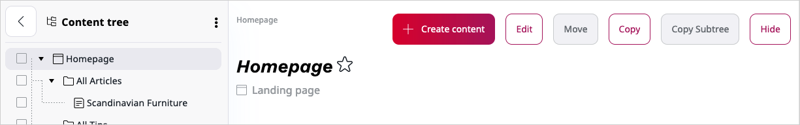
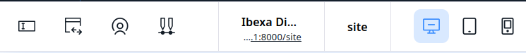
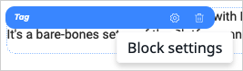

# Working with Page

!!! enterprise
    
    **Page** is a special Content Type that contains zones onto which you can drop different dynamic blocks.
    You can edit it to personalize the layout and contents of your website.
    
    
    !!! tip
        The Page Content Type contains a **Landing Page** Field Type which manages the zones and blocks.
        Any Content item that has the **Landing Page** Field Type will behave like the Page Content Type.
        
    ## Creating Page
    
    To create a new Page, in the upper toolbar click **Content** and from the list below select **Content structure**.
    On the right-side toolbar click **Create** and from the list of Content items select **Landing page**.
    In the **Page creation** select the layout and click **Create**.
    
    You can also add a new Page in the Page Builder.
    Open the Page Builder by clicking **Site** and selecting a site from the list appearing below.
    On the [Page Builder toolbar](#page-builder-toolbar) click the plus button and from the list select **Landing page**.
    Select the layout and click **Create**.
    
    Before publishing or saving the Page, edit its title and description.
    Switch to the Field view using the [Page Builder toolbar](#page-builder-toolbar).
        
    ## Editing Page
    
    You edit Pages using the Page Builder.
    To start editing an existing Page, in the Back Office click **Page** and select the page from the list that appears below. 
   
    
   
    ## Page Builder toolbar
    
    The Page Builder comes with a toolbar that enables you to perform advanced editing and previewing of the Page.
    
    
    
    Using the toolbar buttons, you can perform the following actions:
    
    |Button|Description|
    |------|-----------|
    ||Switch between previewing and editing the Page.|
    ||Switch between the Page view and the Field view.|
    ||Toggle through to see how the Page is rendered on different devices.|
    ||Access the timeline to preview how the Page changes with time. You can also view the list of all upcoming scheduled events. For details, see [Timeline](publishing/advanced_publishing_options.md#timeline).|
    ||Access menu enabling you to switch layout, see versions of the Page, manage translations, or delete the Page.|
    ||Create a new Content item.|
    
    In a newly created Page you must first choose a layout which defines the available zones.
    You can switch it later by using the following menu:
    
    
    
    Applying a layout divides the Page into the defined zones. The zones are placeholders for Content items.
    Now you are ready to add blocks of content to the Page.
    
    ## Adding blocks
    
    In Page Builder you can access a menu of **Elements** — a set of blocks of content that you can add to the zones of the Page.
    Each block is unique in its function and enables you to customize the content appearing on the Page.
    
    
    
    Add a block by dragging it from the menu to an empty place on a zone.
    Do not worry about placing blocks in the proper place from the start.
    You can reorder them at any time by dragging and dropping them in the desired location.
    
    eZ Enterprise comes with a set of ready-to-use Page blocks,
    but [developers can add their own](https://doc.ezplatform.com/en/master/guide/extending_page/#creating-page-blocks).
    
    
    
    The blocks provided with a clean installation of eZ Enterprise are:
    
    |Block|Description|
    |-----|-----------|
    |Form|Embeds a Form Content item that you select from the Content Structure. For details, see [Form block](#form-block).|
    |Code|Enables you to place text, links, images, etc. on your Page using custom HTML. For details, see [Code block](#code-block).|
    |Content List|Displays Content items of a chosen Content Type (or Types) that are contained in a selected folder. For details, see [Content List block](#content-list-block).|
    |Banner|Displays an image Content item with a URL attached to it. For details, see [Banner block](#banner-block).|
    |Collection|Displays a set of Content items you select manually from the Content structure. For details, see [Collection block](#collection-block).|
    |Embed|Embeds a Content item of any Content Type on the Page. For details, see [Embed block](#embed-block).|
    |Gallery|Displays all images contained in a selected folder. For details, see [Gallery block](#gallery-block).|
    |Video|Embeds a video into the Page with standard playback controls. For details, see [Video block](#video-block).|
    |RSS|Loads and displays news from RSS feeds (channels). For details, see [RSS block](#rss-block).|
    |Content Scheduler|Displays Content items at a pre-defined time. For details, see [Content Scheduler block](/publishing/advanced_publishing_options.md#content-scheduler-block).|
    |Text|Enables you to add to the Page a Rich Text block. For details, see [Text block](#text-block).|
    
    ## Block settings
    
    ### Blocks of content
    
    Each kind of block has its special properties. 
    You can access them by placing the cursor on the added block and clicking the cog button.
    Use the same menu to remove the block from the Page by clicking the trash button.
    
    
    
    Settings available for blocks are divided into three tabs — **Basic**, **Design**, and **Scheduler**.
    The settings available in the **Basic** tab are tailored to the block's content.
    
    
    The remaining tabs contain parameters common to all blocks provided with eZ Enterprise. 
    Use them to modify the layout and visibility of a block. For details, see [Advanced publishing options](/publishing/advanced_publishing_options.md).
    
    
    You can't publish a Page if you have not set all the required settings of all blocks.
        
    !!! tip
        Settings and function of custom-made blocks of content depend on their design. 
        For details on adjusting and using them, contact your website administrator.
    
    ### Form block
    
    Note that completing the settings of the Form block requires at least one Form Content item created.
    
    In the **Basic** tab, perform the following actions:
    
    - In the **Name** box, provide the name of the block that will appear on the Page.
    - In the Form section, click **Select content**, navigate through the content and select a Form Content item to append it to the block.
    
    Click **Submit** to save the changes or **Discard** to cancel.
    
    ### Code block
    
    In the **Basic** tab, perform the following actions:
    
    - In the **Name** box, provide the name of the block that will appear on the Page.
    - In the **Content** box, enter the HTML code for the content you want to display on the Page.
    
    
    Click **Submit** to save the changes or **Discard** to cancel.
    
    ### Content List block
    
    In the **Basic** tab, perform the following actions:
    
    - In the **Name** box, provide the name of the block that will appear on the Page.
    - In the **Parent** section, click **Select content**, navigate through the content and select a folder containing Content items
    to display on the list. Click **Confirm**.
    - In the **Limit** section, enter a number or use the up and down buttons to set the limit of Content items to display.
    - From the **Content Types to be displayed** list, select Content Type(s) to be displayed.
    The block will display Content items of the selected Content Types that are in the selected parent folder.
    
    Click **Submit** to save the changes or **Discard** to cancel.
    
    ### Banner block
    
    In the **Basic** tab, perform the following actions:
    
    - In the **Name** box, provide the name of the block that will appear on the Page.
    - In the **Image** section, click **Select content**, navigate through the content and select an image to display.
    - In the **URL** box, enter a URL to open when clicking the selected image.
    
    Click **Submit** to save the changes or **Discard** to cancel.
    
    ### Collection block
    
    In the **Basic** tab, perform the following actions:
    
    - In the **Name** box, provide the name of the block that will appear on the Page.
    - In the **Location list** section, click **Select content**, navigate through the content 
    and add to the collection Content items of any Content Type you want.
    All selected Content items appear in the **Selected items** box at the bottom of the window.
    When done selecting, click **Confirm**.
    
    Click **Submit** to save the changes or **Discard** to cancel.
    
    ### Embed block
    
    In the **Basic** tab, perform the following actions:
    
    - In the **Name** box, provide the name of the block that will appear on the Page.
    - Select content to embed by clicking **Select content**. Navigate to a Content item, select it and click **Confirm**.
    
    Click **Submit** to save the changes or **Discard** to cancel.
    
    ### Gallery block
    
    In the **Basic** tab, perform the following actions:
    
    - In the **Name** box, provide the name of the block that will appear on the Page.
    - In the **Folder** section, click **Select content**, navigate through the content, select a folder containing images to display and click **Confirm**. 
    After submitting the settings, all images in the folder will appear in the Gallery block. 
    Note that selecting a folder containing Content items other than images results in displaying only a link to the folder they are stored in.
    
    Click **Submit** to save the changes or **Discard** to cancel.
    
    ### Video block
    
    In the **Basic** tab, perform the following actions:
    
    - In the **Name** box, provide the name of the block that will appear on the Page.
    - In the **Video** section, click **Select content**, navigate through the content, select a video to display in the block and click **Confirm**.
    In the **Basic** tab you can preview the selected video before adding it to the Page.
    
    Click **Submit** to save the changes or **Discard** to cancel.
    
    ### RSS block
    
    In the **Basic** tab, perform the following actions:
    
    - In the **Name** box, provide the name of the block that will appear on the Page.
    - In the **URL** box, provide the URL for the RSS news feed.
    - In the **Limit** box, enter a number or use the up and down buttons to set the limit of news items appearing in the block.
    - In the **Offset** box, enter a number or use the up and down buttons to set the limit of featured news items appearing in the block.
    
    ### Text block
    
    In the **Basic** tab, perform the following actions:
    
    - In the **Name** box, provide the name of the block that will appear on the Page.
    - In the **Content** box, enter text, images, videos, etc. using the Online Editor. 
    For details, see [Editing Rich Text Fields](creating_content_basic.md#editing-rich-text-fields).
    
    When done editing, click **Submit** to save the changes or **Discard** to cancel.
    
    ## Publishing Page
    
    If you are ready to publish the Page click **Publish** in the top-right corner.
    To save it as a draft to finish editing it later, click **Save draft**.
