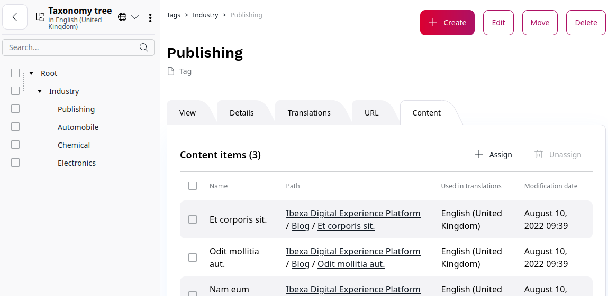

# Taxonomy

Most content can be structured in logical ways, using categorization or labelling.
Tags enable you to organize content according to different keywords (tags) and relationships between them, making it easier for your site users to find content they are interested in. They also allow you to create dynamic content pulls to display information customized for your pages and users.

## Taxonomy tree

In the site tree in the left panel, you can create a hierarchy of all tags and navigate in the platform.
Working with the Taxonomy tree is similar to working with the Content structure tree.

### Add tag

There are two ways to create tags: directly in the taxonomy tree or by clicking the **Create** button in the **Tags** section.

1. To create a new tag using taxonomy tree, in the left panel click **Content** -> **Tags**.
1. In the **Root** section, click the three dots icon on the level/place you want to add new tag and select **Add tag**.
1. Enter a unique name for the new tag.
1. Add the tag's identifier.
1. (Optional) Add tag description.
1. To set the parent category, click the **Select parent** button.
1. To save a new tag, click **Save**.

Now, the tag is visible in the taxonomy tree.

### Assign tag to content from taxonomy tree

When you edit or create a Content Type, in the section **Select tags**, you can add a tag by typing or clicking **Select from tree**.
You can add many tags.

See [Add taxonomy entries](creating_content_basic.md#add-taxonomy-entries).

### Add tag translation

If you have more than one language version of your site, you can also translate tags used in the site into the target language.

1. Go to the **Tags** section.
1. Click a tag and go to the **Translations** tab.
1. Click **+Add new** and from the available languages, set the source and target language.
1. To finish, click **Create**.

### Delete tag

You can delete tags directly from the taxonomy tree. Go to **Tags** section.

1. Click the three dots icon next to the tag you want to delete.
1. From the context menu, select **Delete**.

### View all Content items with specific tag

You can view a list of all Content items which are tagged with the given tag.
To do it, go to **Tags** section.
In the taxonomy tree click the respective tag and go to the **Content** tab.

