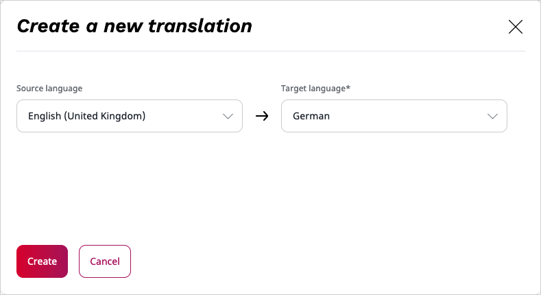
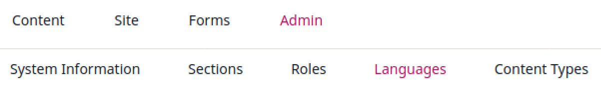
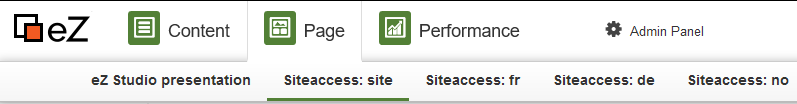

# Translating content

The content on your website can be translated into different languages. Each Content item can have different language versions.
The version visible to a visitor depends on the way your installation is set up (see [SiteAccess](#siteaccess)).

## Adding translations

You can create a new translation of a Content item by going to the **Translations** tab and clicking the plus button.
You will see a list of all available languages. You can also base the new translation on an existing one.
All the Fields will then be pre-filled with the values they have in the base translation.
If you do not choose a base translation, the Fields remain empty. Every time you add or edit any translation,
the Content item gets a new version, the same way as when editing only one language.

You can only add translations in languages that have been set up for your website in the **Admin Panel**.
To create a new language for the website, go to the **Admin Panel**, open the **Languages** tab, and click the plus button.

Every new language must have a name and a language code written in the xxx-XX format, for example eng-US, fre-FR, nor-NO, etc.
After adding a language, you may have to reload the application to be able to use it.

!!! caution

    After adding a language, you should be able to start adding translations to your content.
    However, depending on the way your website is set up, additional configuration may be necessary
    for the new language to work properly, especially with SiteAccesses.
    It is recommended you contact your administrator and inform them if you need to add a new language to the website
    (see [the technical documentation on language versions](https://doc.ibexa.co/en/master/guide/internationalization/)).

## SiteAccess in Page mode [[% include 'snippets/experience_badge.md' %]] [[% include 'snippets/commerce_badge.md' %]]

When working in Page mode, at the top of the page, you can see a bar that lists the most recently used SiteAccesses on your website.

You can use this bar to switch between the different versions and work on them.

Click the SiteAccess list icon in the bar to see the full list of all SiteAccesses.

SiteAccesses are a means to present different versions of the website to different categories of users.
You can treat SiteAccesses as different "entrance points" to your website. They allow you to show different content or design to the visitor depending on which SiteAccess they use.
SiteAccesses can be used for example to serve a different website version for paying and non-paying visitors
or different language versions to visitors from different countries.

See [Site Factory](site_organization/site_factory.md) for more information about setting up sites.
