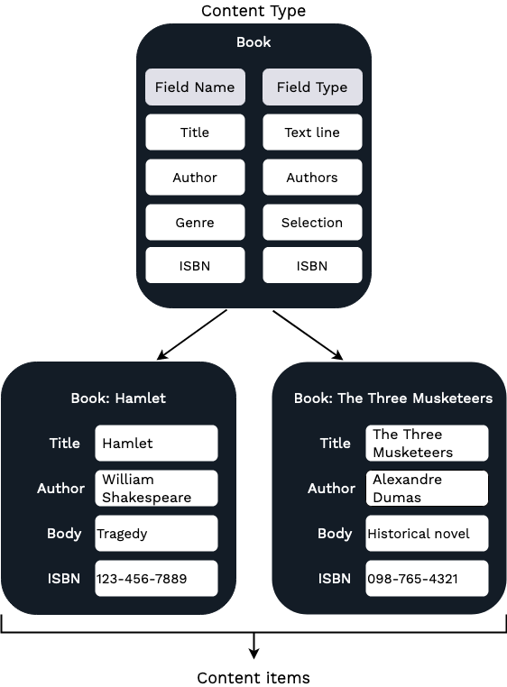

# Under the hood, concepts and organization

## Content Model

At the heart of eZ Platform is a repository that stores all your content.
In eZ Platform everything is content: not just the actual pages that are displayed in the website,
but also all media (images, videos, etc.) and user accounts.

eZ Platform lets you customize and adapt your content model depending on the type of website you create and your needs.

Depending on your organization, if you are an editor or a content creator,
it is possible that the content model for your installation has already been created by your administrator or content manager.
However, even a non-technical user can easily create or modify the Content Model through the editing interface.

### Content Types

Conceptually, you can treat a **Content Type** as a kind of pattern (a template) on which you base Content items.
Whenever you create a new Content item, you must choose the Content Type to which it will belong.

The Content Type defines what Fields will be available in the Content item.
A Content item may only contain the exact Fields that are defined in the Content Type (although not all of them must be obligatory).

eZ Platform allows you to create, edit and delete Content Types and their Fields.
A clean installation contains a few basic Content Types (Article, Folder, File, Image, User and User Group).

To see what a larger set of Content Types and their Fields looks like in practice, you can take a look at the Demo Bundle.
[Demo is a separate installation with a sample website](https://github.com/ezsystems/ezplatform-demo) in which you can preview different features of eZ Platform.

You can visualize Content Types as baking molds with different shapes and sizes which are then filled with cake, that is Content items.

### Content items

The basic unit with which you operate in eZ Platform is a **Content item**.
A Content item is a single piece of content: an article, a blog post, an image, a product, etc.
Each Content item has general characteristics such as name, but most importantly, it contains a number of **Fields**.
These Fields will differ depending on what kind of Content you are dealing with.
An *article* Content item may have Fields such as *title*, *name*, *author*, *body*, *image*, *subscriber teaser*, etc.
A *product* Content item may have *product name*, *category*, *price*, *size*, *color*, etc. as Fields.

Continuing with the baking metaphor, Content items are the cake you make based on molds.
The mold defines the shape of the cake, but you can fill each mold (Content Type) with different types and tastes of cake,
and can bake many different cakes in the same mold.

### Content items versus Content Types

The difference between Content items and Content Types is important for understanding content management in eZ Platform.

A Content item is an instance of a particular Content Type, in other words a single object created based on a Content Type template.

When a Content item is created, it inherits the Fields from its Content Type.
However, the values of the Fields (their "contents") are empty and you need to fill them separately for each Content item.
The Fields in a Content Type are only definitions. This means that they describe what Fields of what kinds will be present in a Content item,
but as a rule they do not provide these Fields' values.

As a consequence, all Content items of the same Content Type will share the same set of Fields, but their Field values will be different.

As an example, let's imagine you need to store book information.
You create a new Content Type called "Book" and give it Fields such as Title, Author, Genre, ISBN, etc.
Next, based on this Content Type, you can create any number of Content items.
The empty Fields will be ready to be filled in with the information about each specific book:

### Fields and Field Types

Just like every Content item is based on a Content Type, so every Field is defined by one of the Field Types.

A Field Type defines what kind of data is stored in a Field.
For example, a Field with a TextLine Field Type stores a single line of text, an Image Field Type stores an image file,
and Author Field Type holds information about author details (like name, email).
By default, the system comes with a large set of Field Types that cover most common needs
(e.g. Text line, Rich text, Email, Author list, Content relation, Map location, Float, etc.)

### Content model in summary

What you should know:

**Content Types:**

- A Content Type defines Fields that a Content item will be composed of.
- Every Field is modeled after a Field Type which defines the kind of data it contains.

**Content Items:**

- A Content item consists of a number of Fields.
- Every Content item is based on a Content Type.

**Fields and Field Types:**

- eZ Platform comes with a collection of essential Field Types.
- It is possible to extend the system by creating custom Field Types for special needs.

## Content and media

When you are in the editing interface, you can view the content in your repository in three places:

- Content structure
- Media library
- User list

They represent three categories of Content Types that you can create
(see [Content Types](organizing_the_site.md#content-types)).

### Content tree and the Content browser

If you want to get an overview of the content currently in your website, go to the Content work mode
and select the appropriate tab: **Content structure** or **Media**.
A **Browse** option on the left lets you browse through all the Content of the respective category.
User accounts, which are also considered content in eZ Platform, you can view through the Admin Panel
(see [Users](organizing_the_site.md#users)).

During your work with eZ Platform you will often be asked to select content from the repository.
This happens for example when you want to move or copy, a Content item, embed an image, link two Content items, etc.
In such cases you will make use of the **Content Browser**.

The Content Browser allows you to navigate through all content in the site, including regular content, media and User accounts.
You can also use it to search the repository for content, and to create new content when needed.

