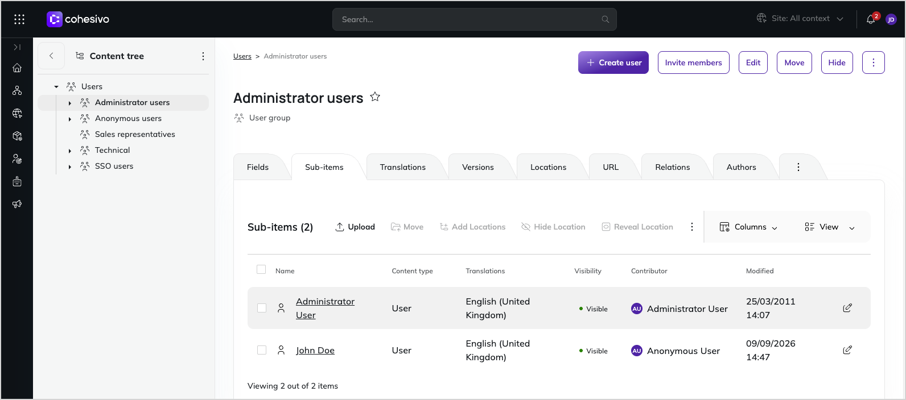

# Manage users

Users in [[= product_name =]] are treated the same way as other content items.
They're organized in groups, which helps you manage them and their permissions.

You can view all user groups and Users in the **Administration** panel by selecting **Users**.
Here, you can manage users, their relations, roles, and policies.
As you can see, the interface is the same as when working with regular content items.

!!! caution

    Be careful not to delete an existing user account.
    If you do this, content created by this user can be broken and the application can face malfunction.

## Create users

To give someone access to the back office, create a user:

1. Go to **Administration** -> **Users**.
2. Navigate to the user group the user should belong to.
3. Click **+ Create user**, select the content type depending on the type of user that you want to create, and click **Create**.
4. Fill in user data, including the user account data:

    - In the **Email** field, enter the user's email address. The email address is the user's login.
    - Enter the password, or click **Generate password**.
    - Switch the **Enabled** toggle on. Users who aren't enabled can't log in.

5. Click **Save and close**.

You can now provide the new user with their access rights.
To control which parts of the system the user can access, assign [appropriate roles and permissions](work_with_permissions.md).
